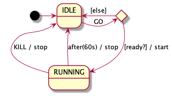
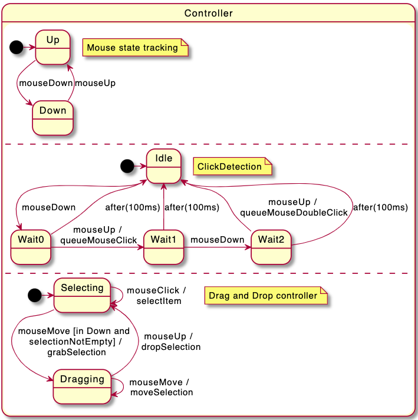

# Cogent Project

Generate Code from PlantUML statecharts.

Author: Theodore Norvell (theo@mun.ca)

## Example and prerequisites

The input is a plant UML spec such as



```
@startuml
    state IDLE 
    state RUNNING
    state C <<choice>>
    [*] -> IDLE
    IDLE -> C : go
    C -> RUNNING : [READY] / start
    C --> IDLE : [else]
    RUNNING -> IDLE : kill / stop
    RUNNING -> IDLE : after(60s) / stop
@enduml
```

Running Cogent with command line

```
   scala cogent-assembly-1.0.jar foo first_example.puml first_example.c
```
generates a controller in first_example.c that declares the following procedures.

```C
void initStateMachine_foo( TIME_T now ) 
{
    ...
}
bool_t dispatchEvent_foo( event_t *event_p, TIME_T now ) {
{
    ...
}
```

where `foo` is the name of the statechart, obtained from the command line.

This C file can be included into another C file that defines certain prerequisite types, constants, and procedures, discussed below.

As events happen they should be fed into the generated controller and it will react by changing its own state and executing actions.  The result of the controller is `true` if the event was handled and `false` if the event was ignored. In our example, `kill` events are ignored when the state is `IDLE` and `go` events are ignored when the state is `READY`.

## Prerequisites

The generated code has some prerequisites which need to be supplied. You need to define

* A type `bool_t` and constants `true` and `false`
* The `event_t` type.
* A function (or a function-like macro) `eventClassOf(event_t*)` which produces an member of an enum type.
* The members of that type correspond to the triggers in the diagram: In the example above there
should be members `go` and `kill`. There should also be a member called `TICK`. For example, this would do

```C
    typedef enum EventClass_e {go, kill, TICK} ;
```
* A type named `status_t` along with a constant (or macro) `OK_STATUS` and a boolean function (or function-like macro) `OK( status_t )`. For example I might declare

```C
    typedef status_t int16_t ;
    #define OK_STATUS ((int16_t)0)
    #define OK( s ) ( (s)==OK_STATUS )
```
* For each action, there needs to be a function of type `status_t (const event_t *, status_t status)` with the same name as the action. The input status is the status of the previous action on the same compound transition or `OK_STATUS` if there is none. For the example above, we would need to supply functions

```C
    status_t start(const event_t *, status_t status) {
        ...
    }
    status_t stop(const event_t *, status_t status) {
        ...
    }
```

In this particular example, the input status in both cases will be `OK_STATUS`, since `start` and `stop` are the first actions on their compound transitions. In both cases, the output status is ignored since `start` and `stop` are also the last actions on their transitions, and there are no subsequent guards that depend on the status.

* For each guard, there needs to be a function of type `bool_t (const event_t *, status_t)`.  For the example above, we would need

```C
    bool_t READY(const event_t *, status_t) {
        ...
    }
```

* A macro `TIME_T` and a macro `IS_AFTER(d, t0, t1)` that gives a boolean result. The inputs to the macro are
    
    * d -- a duration in milliseconds of type `unsigned int`. 
    * t0 -- a time of type `TIME_T`
    * t1 -- a time of type `TIME_T`

  The default for `TIME_T` is `unsigned int` and the default for the `IS_AFTER` macro is `((d) >= (unsigned)(t1)-(unsigned)(t0))`. This works if `TIME_T` measures time in milliseconds.  If time were measured in units of `m/n` milliseconds, then this should be modified to `(n*(d) >= m*((unsigned)(t1)-(unsigned)(t0)))`. A consequence of these defaults is that, even if the time wraps around to 0, the `IS_AFTER` macro will continue to give good results, as `d` is not insanely big.
* A macro or function "void assertThat( bool_t )".  This should do nothing if the argument is true. What it does if the argument is false is up to you.
* A macro or function "void assertUnreachable()".  What this does is up to you.


[In the future, Cogent will have defaults for all the prerequisites 
except for the guard and action methods.]

## TICK events

TICK events are used to trigger transitions labelled "after( D )" where D is a duration in seconds or milliseconds.  My advice is after every event that makes the controller return true, feed the controller a sequence of TICK events until it returns false.

```C
     /* Do this shortly after an event happens. */
     bool_t handled = dispatchEvent_foo( &event , now) ;
     int count = 0 ;
     while( handled && count < MAX ) {
         handled = dispatchEvent_foo( &tick, now ) ;
         count += 1 ;
     }
```

And you should periodically send the controller a sequence of tick events fairly frequently:

```C
     /* Do this fairly frequently. */
     bool_t handled = dispatchEvent_foo( &tick, now ) ;
     int count = 0 ;
     while( handled && count < MAX ) {
         handled = dispatchEvent_foo( &tick, now ) ;
         count += 1 ;
     }
```

To accomplish both these above, if there is a queue of events,
then the following code could be executed periodically

```C
    time_t now = getTime() ;
    event_t event ;
    bool_t success = takeFromQueue( & event ) ;
    if( success ) {
        do {
            bool_t handled = dispatchEvent_foo( event, now ) ;
            int count = 0 ;
            while( handled && count < MAX ) {
                handled = dispatchEvent_foo( &tick, now ) ;
                count += 1 ;
            }
            success = takeFromQueue( & event ) ;
        } while( success ) ;
    } else {
        bool_t handled = dispatchEvent_foo( &tick, now ) ;
        int count = 0 ;
        while( handled && count < MAX ) {
            handled = dispatchEvent_foo( &tick, now ) ;
            count += 1 ;
        }
    }
```


## Details

### States and pseudostates

States and choice pseudostates (TODO: this may change; revisit this statement later.)should have names that are proper C identifiers and should be less or equal to 20 characters.

But, you can define a state like this

```
state "Configuring\nmode" as Configuring
```

so it will appear in renderings however you want it.

States can be simple states or composite states. Composite states can have one region or multiple regions.

#### Simple states

Like in the first example:

#### Composite states

I.e. states with children.


```
@startuml
state W {
            [*] -> W1
            state W1
            state WC <<choice>>
            state W2 {
                [*] -> W21
                state W21
                state W22
                W22 -> WC : a / p
            }
            state W3 {
                [*] -> W31
                state W31
                state W32
            }
            WC --> W1 : [A] / q
            WC --> W32 : [B] / r
}
@enduml
```

#### Composite states with multiple regions

Composite states may have multiple regions; this allows for a form of concurrency. Each region operates as a separate pseudo-thread.



```
@startuml
    state Controller {
        note "Mouse state tracking" as A
        state Up
        state Down
        [*] -> Up
        Up --> Down : mouseDown
        Down --> Up : mouseUp
        --
        note "ClickDetection" as B
        state Idle
        state Wait0
        state Wait1
        state Wait2
        [*] -> Idle 
        Idle -> Wait0 : mouseDown
        Wait0 -> Wait1 : mouseUp /\n queueMouseClick
        Wait0 --> Idle : after(100ms)
        Wait1 -> Wait2 : mouseDown
        Wait1 --> Idle : after(100ms)
        Wait2 -> Idle : mouseUp /\n queueMouseDoubleClick
        Wait2 --> Idle : after(100ms)
        --
        note "Drag and Drop controller" as D
        state Selecting 
        state Dragging
        [*] -> Selecting 
        Selecting -> Selecting : mouseClick / \n selectItem
        Selecting --> Dragging : mouseMove [in Down and \n selectionNotEmpty] / \n grabSelection
        Dragging --> Selecting : mouseUp / \n dropSelection
        Dragging --> Dragging : mouseMove / \n moveSelection
    }
@enduml
```

Cogent will make up names for the regions, like `A_region_0` and `A_region_1`. Currently these might be in any order and the order might vary from run to run of the program.

#### How Cogent sees states

Cogent has it's own way of looking at states, which differs a bit from the UML standard. To better understand its error messages, it helps to understand this.

* BASIC states: The same as UML's simple states.
* AND states: Composite states with multiple regions are called AND states.
* OR states: The entire diagram is an OR state.  Composite states with only one region are OR states.  Regions that have at least one sibling region are also OR states.

For example in the diagram above:

* The diagram is an OR state, the root state.
* `Controller` is an AND state and is the only child of the root state
* `Controller`'s three regions are each OR states and are children of the AND state.
* All others are BASIC states which are children of the OR states representing the regions.

In the previous diagram, W, W2, W3, and the whole diagram are OR states.  The single region inside of W, for example, is not considered to be a state.

It might be logical to consider W, W2, and W3 to be AND states, each with one child (its region), which is an OR state. That way all OR states would correspond to a region -- if we consider the whole diagram to be a region. But this is not the way Cogent sees it.  (This might change if we ever support internal actions.)

#### Initial pseudostates

Each OR state should have one (and only one) initial pseudostate and it should have one and only one transition out of it. This transition must go to a sibling state and should not have an label.

As an exception, an OR state with only one child state does not need a initial pseudo state.

#### Choice pseudostates

As shown in the examples, choice pseudostates can be used.

#### Final states

Final states are not supported. Completion events are not supported.

#### Submachines

Submachines play the same rule in statecharts as subroutines play in programming.

Submachines are not supported yet.

Supporting them in the future is fairly important since: PlantUML can have trouble dealing with large complex diagrams. And, even if PlantUML did do a good job of rendering large complex diagrams, large complex diagrams can be difficult to understand and review.

#### Other pseudostates

* History pseudostates are not supported yet.
* Junction pseudostates would be easy to support, but I don't know how to make them in PlantUML. You can use choice pseudostates with just one exiting edge, instead.
* Entry and exit pseudostates are not supported yet.
* Terminate pseudostates are not supported.
* Fork and join pseudostates are not supported.

#### Notes

Notes are ignored.

### State Actions

Entry and exit actions for states are not yet supported.

Do actions are not supported.

Internal actions are not supported yet.

### State semantics

Each OR state has at all times a "current child", which is one of its children.

There is a set of states which are the active states.

When the machine is at rest. We have the following invariants:

* ROOT: The root state is always active.
* OR0: For any OR state, including the root state, if the OR state is active, then the current child of the OR state is also active.
* OR1: When an OR state is active, none of its children except its current child are active.
* OR2: When an OR state is not active, none of its children are active.
* AND0: For any AND state, if it is active, all of its children will be active.
* AND1: For any AND state, if it is not active, none of its children will be active.

Invariants OR0 and AND0 could be untrue when the machine is not at rest .  Consider this example


```
@startuml
state W {
            [*] -> W1
            state W1
            state WC <<choice>>
            state W2 {
                [*] -> W21
                state W21
                state W22
                W22 -> WC : a / p
            }
            state W3 {
                [*] -> W31
                state W31
                state W32
            }
            WC --> W1 : [A] / q
            WC --> W32 : [B] / r
}
@enduml
```

Suppose W, W2, and W22 are all active and the machine is at rest. This implies (by the invariant) that W2 is the current child of W and W22 is the current child of W2.  Let's also suppose that W31 is the current child of W3.

* First W22 is exited, so it becomes inactive.
* At this point, W2 is active, but its current child is not, violating OR0
* Next W2 is exited, so it also becomes inactive.
* That fixes the violation just noted.
* But now W is active, but its current child, W2, is not!, violating OR0 again.
* At this point, action p takes place. Then guards A and B are evaluated and then either actions q or r. So the code you write might execute while OR0 are violated.
* Supposing B is true and A is false, then W3 will be become active and at the same time it becomes the current child of W, thus correcting the violation of OR0.
* However, since W31 is the current child of W3 but is not active, there is a new violation of OR0.
* Finally, W32 is entered and then becomes active and at at same time becomes the current child of W3. This ensures that OR0 is true everywhere.

Similarly at the point when the exit or entry action of an AND state is executed, we can expect that AND0 will be violated for that AND state.

### Transitions

Each transition is labelled with

* A trigger (optional)
* A guard (optional)
* A sequence of actions (possibly empty)

in that order.

Here are some examples

```
    A -> B : a [ p ] / x; y; z
    A -> B : after(20ms) / \n {reset(counter24);}
    A -> B : [not in X and ready or {justdoit}] 
    A -> B : [else] / go
```
Newlines ("\n") are treated as spaces.

#### Triggers

Triggers can be:

* Named triggers: Just a name. These correspond to event classes.
* After triggers: after( D ) where D is a duration.

    * Currently a duration is a non-negative integer constant followed by either s for seconds or ms for milliseconds.  Examples "after( 0s )", "after( 255 ms)".
    * The maximum duration depends on your implementation of the `TIME_T` and `IS_AFTER` macros and is not checked by cogent.
    * A state can have multiple exiting edges with 'after' triggers; these guards are checked from shortest duration to longest.
    * Transition labelled with 'after' triggers only first on `TICK` events.

* If there is no trigger on an edge leaving a state, it is considered equivalent to `after(0s)`, meaning it's transition can be triggered by any `TICK` event. 

Edges leaving choice nodes must not have a trigger.

#### Guards

Guards are either the special guard "[else]" or boolean expressions enclosed in brackets. For example:

* "[ A ]"
* "[ A and not B or C implies D]"
* "[ A && ! B || C ==> D]"

Basic guards are 

* A C identifier. This is translated to a function call, e.g. "A" translates to "A( eventP, status )"
* Any text between braces. E.g. "{x>10}". These are not translated at all, but output as-is with the braces replaced by parentheses.
* "in S" where S is the name of a state.  This will be true if state S is active at the time.
* "OK" this will translate to a `OK( status )`. Note that this is pointless on transitions that leave states, since the `status` variable is initialized to `OK_STATUS`. It only makes sense on transitions that leave choice nodes.

The boolean operators follow the usual rules of precedence (not, then and, then or, then implies) and are right associative.

All keywords (else, not, and, or, implies, OK, in) are case sensitive.

For any given vertex / trigger combination, the guards on the edges have the following restrictions.

* If a transition out of a state has no guard, then it should be the only edge for that trigger.
* At most one transition may be labelled with an `[else]` guard.
* If the vertex is a choice pseudostate and there is no else, then at least one guard must be true. This is not checked until runtime.
* On the other and, if a state has no else and all guards are false, it is not an error, but it will result in the trigger being ignored.


#### Action sequences

A sequence of one or more actions can follow a slash "/". Each action can be followed by an semicolon, but this is optional.  Examples

* ` `  — an empty sequence is indicated by the absence of a slash
* `/ a` or `/ a;`  — two ways to write a sequence of 1 action
* `/ a b c`, `/ a; b; c`, `/ a; b; c;` — three ways to write a sequence of three actions

#### Actions

Each action is either

* A C identifier, such as "f". This is translated into a function call "status = f( event_p, status );".
* Any code within braces.  This is copied verbatim into the controller with an extra semicolon tacked on the end. E.g. you could write "{status = 42}" and the generated code will be "{ status = 42 ; }".


### Restrictions on transitions.

Transitions come in three flavours

* Strawberry: From a initial pseudo state to a state with the same parent.
* Vanilla: From a state (simple or composite) to another state or to a choice pseudostate.
* Chocolate: From a choice psuedostate to a state or to another choice psuedostate.

Strawberry transitions should not be labelled.

Vanilla transitions should have a trigger.  (If the source state is a simple state, Cogent will rewrite a missing trigger as "after(0s)".)

Chocolate transitions should not have a trigger.

Chocolate transitions may not form a cycle.

For any state, if there is more than one transition out of it with the same named trigger then, of these transitions:

* at most one may be guarded with an else and
* none may be unguarded.

The same restrictions apply to the set of all transitions that leave a given choice pseudo-state.

### Using guards appropriately

A vanilla transition is enabled if its source state is active and:
* it has no guard,
* it has a guard that is true, or
* it has an else guard and all the competing guards are false.

When there are multiple enabled transitions out of a state for the event, only one will fire, but the choice is arbitrary and unpredictable (unless you read the code, but that could change, when it is next generated).  For example, if there are guards A, B. The generated code for that state/event pair might look like this:

```C
   status_t status = OK_STATUS ;
   if( A(event_p, status) ) { <<Do transition guarded by A>> }
   else if( B(event_p, status) ) { <<Do transition guarded by B >>}
   else { <<Do nothing>> }
```

or like this:

```C
   status_t status = OK_STATUS ;
   if( B(event_p, status) ) { <<Do transition guarded by B>> }
   else if( A(event_p, status) ) { <<Do transition guarded by A>> }
   else { <<Do nothing>> }
```

For the set of all edges leaving a given state that are all labelled with the same named trigger:

* It is good practice to ensure that at most one guard will be true.

Once a vanilla transition is traversed, the machine is committed, there is no turning back. If it reaches a choice state where no guard is true, the dispatcher will call `assertUnreachable()`.

E.g. if the only two transitions out of a choice pseudostate are guarded by A and B the generated code for that choice pseudostate could be

```C
   if( A(event_p, status) ) { <<Do transition guarded by A>> }
   else if( B(event_p, status) ) { <<Do transition guarded by B>> }
   else { assertUnreachable() ; }
```

or

```C
   if( B(event_p, status) ) { <<Do transition guarded by B>> }
   else if( A(event_p, status) ) { <<Do transition guarded by A>> }
   else { assertUnreachable() ; }
```

Note that, if `assertUnreachable` simply reports the problem and returns, the machine will (almost certainly be) left with a set of active states that violates invariants OR0 and/or AND0.  This is because it will have left at least one state, but will not have entered another.

For the set of all transitions leaving a given choice pseudo state:

* It is necessary that you ensure that at least one guard will be true, or that you have an else-guarded transition.
* It is good practice to ensure that at most one guard will be true.

#### Using status appropriately

Just before any vanilla transition, a status variable is initialized to `OK_STATUS`.  The status is then threaded through the actions and can be accessed in the guards.  E.g. consider this set of transitions


```
@startuml
state A
state B <<choice>>
state C
state D
A -> B : a / f; g
B -> C : [OK] / h
B -> A : [{status==1}] / m
B --> D : [else] / n
@enduml
```

Here the input status of `f` will be `OK_STATUS` and the output status of `f` will be the input status of `g`. Then the output status of `g` is used to make the decision and then it is input to `h`, `m`, or `n`.  The code for state `A` on event `a` might look like this

```C

status_t status = OK_STATUS ;
...some code to exit A...
status = f( eventP, status ) ;
status = g( eventP, status ) ;
if( OK( status ) ) {
    status = h( eventP, status ) ;
    ...some code to enter C...
} else if( (status==1) ) {
    status = m( eventP, status ) ;
    ...some code to enter A...
} else {
    status = n( eventP, status ) ;
    ...some code to enter D...
}
```

### Pre-emption

When there are enabled transitions out of more than one state that could all fire.  Transitions that leave child (or grandchild, etc) states have priority over transitions out or parent (or grandparent, etc) states.  For example:


```
@startuml


state A {
    state B
    state C
    [*] -> B
    B -> C : a [P] / x
    --
    state D
    state E
    [*] -> D
    D -> E : a [Q] / y
}
state F 
[*] -> A
A -> F : a / z ;

@enduml
```

Suppose the active states are A, B, and D. 

* If not P and not Q, then the transition from A to F will fire.
* If P and not Q, then the transition from B to C will fire. The transition from D to E is blocked because Q is false and the transition from A to F is blocked by pre-emption.
* If not P and Q, the situation is similar. Only the transition from D to E fires.
* If P and Q, then both the transition from B to C and the transition from D to E will fire and the transition from A to F will be blocked by pre-emption.

When two vanilla transitions fire concurrently, as in the previous example, they actually go sequentially on the same thread, so there is no need to worry about mutual exclusion and race conditions between x and y. The generated code will follow this algorithm:

1. if P : exit B; do x; enter C
1. if Q : exit D; do y; enter E
1. if neither of the above happened (i.e. P and Q were both false when evaluated): exit B; exit A's upper region; exit D; exit A's lower region; exit A; do z; enter F

or the same with the first two lines swapped.  Likewise the exits on the last line could happen in an alternative order

* exit D; exit A's lower region; exit B; exit A's upper region; exit A;

As you can see from algorithm of the generated code, the x action should not effect the truth of Q and the action y should not affect the truth of P otherwise things get very hard to analyse.  Likewise you have to be careful with "in" guards. For example if P were "in D" and Q is true, that would be ugly since whether that "in D" is true or not depends on whether the other transition is considered first.

### Local vs external transitions

UML considers transitions to be either **external** or **local**. Local transitions do not exit the state which they start at, whereas external transitions do.

Consider these two diagrams. The only difference (aside from the action's name) between the input files is that the first file uses "->" for the M to O transition, which the second uses "-->". In the first, PlantUML renders the transition from M to O as exiting M before re-entering M and ending at O.  This is the correct notation for an external transition. In this case the y action should be executed.


```
@startuml
state M {
      M : exit / y
      [*] -> N
      N -> O 
      M -> O : a
}
@enduml
```

For the second diagram, PlantUML renders the transition from M to O as a local transition.  The x action should not be executed.


```
@startuml
state M {
      M : exit / x
      [*] -> N
      N -> O 
      M --> O : a
}
@enduml
```

Cogent currently considers all vanilla and chocolate transitions to be external. That is that they exit their source and they enter their destination, even if PlantUML draws the diagram "wrong", as in the previous image.

[There should really be a warning when the diagram could be drawn either way.]

[Note that this aspect of cogent may change in the future.]

### PlantUML limitation on edges

PlantUML currently rejects diagrams with any transitions that enter or leave a region when that region has sibling regions.

For example, the edge from T to R leaves its region.

```
@startuml
state R {
      [*] -> S
      --
      [*] -> T
      T -> R
}
@enduml
```

Cogent doesn't have any problem with these transitions in principle. But, since it uses PlantUML for parsing, they are rejected by Cogent's parser.