# Implementing StateCharts

## Introduction

Statecharts are a formalism for describing finite state machines.  Statecharts allow complex state machines to be expressed concisely and, if used carefully, understandably.  State machines are widely used in digital hardware design, embedded software design, user experience design, protocol design, and many other things.

Statecharts were introduced by David Harel in the 1980s [1].  Because they are visual and fairly simple to understand, he found that they were a good medium for expressing behavioural ideas to people who are not familiar with other ways of expressing algorithms, such as code, pseudocode, or flowcharts.  (More on flowcharts later.)  In Harel's case he developed them while consulting for the Israeli air force and he found them to be a good medium for presenting algorithmic ideas to pilots.

In the 1990s, statecharts were adopted as one of the diagram types in UML. As a result there is a standard syntax and a fairly well defined semantics, suitable for software.  My understanding of the finer points of the semantics comes largely from von der Beeck's article on the semantics of UML statecharts, which is  based on the UML specification.

The point of this article is to try to explain statecharts and look at how to implement them for real-time embedded systems.  The strategy that I'll take is to introduce the features of statecharts a few at a time and look at how to modify our implementation strategy to accommodate the newly introduced ideas.

**Reading this document:**  If you aren't familiar with statecharts, I'd suggest reading this document twice.  The first time, skip the sections with "implementation" in their names; that will give an introduction to statecharts.  Then read the document again, this time reading the implementation.

## Simple state machines

Reactive systems spend most of their time waiting for something to happen.  When an embedded system is based around a microcontroller, the microcontroller will often switch to a low power mode while it waits for the next thing to happen to it or for a certain amount of time to pass.  Then it reacts by taking some action and usually goes back to a low power mode.  Which events a reactive system will react to and how it will react to them depends on what events it has experienced in the past.  A state represents a summary of this history.  When the system is waiting, it will be in some state.  Which state it's in will (largely) determine which events it will react to and how it reacts to them.

Here is a first statechart.

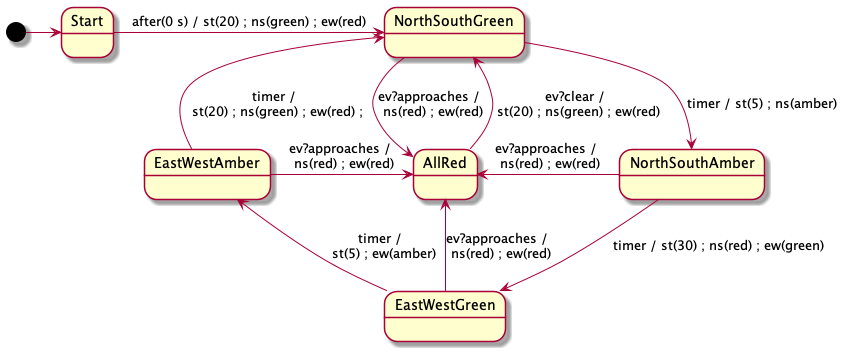

There are 6 **states** shown in this diagram: `Start`, `NorthSouthGreen`, `NorthSouthAmber`, `EastWestGreen`, `EastWestAmber`, and `AllRed`.  The black ball is not a state but serves to indicate which state is the **initial state**. The black ball is sometimes called a **pseudo state**.

The arrows between states are called **transitions**. Each transition is labelled trigger, and a sequence of **actions**.  The syntax for transition labels, so far, is one of

> *trigger* / *sequenceOfActions* 
> *trigger*

A trigger is typically the name of a class of signals.  This means that the transition can be triggered by the arrival of a signal with that name.

 There are also time triggers, such as the "after(0 s)" trigger on the transition out of the "Start" state.  As you would expect this means that the "Start" state can be left as soon as it's been entered.  We'll look at time events with longer delays and absolute times later on.

So far, the syntax of triggers is one of

> *signalName*  
> `after( 0s )`

For this statechart there are 3 classes of signals named `timer`, `ev?approaches`, and `ev?clear` .   I use the convention that a message *m* received on a channel *x* gets the name *x?m*. That's not part of the UML standard, but it makes it clearer where which events are messages and where they are coming from. 

It's a good idea to make a table to explain what kind of event each signal class corresponds to. 

| Signal class | Meaning |
|---------------------|-----------------|
| `timer`          | The internal timer expires. |
| `ev?approaches` | A message arrives from central dispatch indicating that an emergency vehicle is approaching. |
| `ev?clear` | A message arrives from central dispatch indicating that no emergency vehicle is approaching. |

We also have a number of actions shown in the statechart.  We should make a table explaining them as well 

| Action | Meaning |
|---------------------|-----------------|
| `st( n : Real )`        | Set the internal timer to expire in `n` seconds.  Any pending setting is overridden. For example if an `st(5)` actions is shortly followed by an `st(30)` action, the effect of the first is nullified. |
| `ns( c : Colour)` | Set the lights for north and south going traffic to colour `c`. |
| `ew( c : Colour)` | Set the lights for east and west going traffic to colour `c`. |

## Semantics for simple state machines

Statecharts handle one event at a time.  Events are usually processed in the order they arrive, but they don't have to be. The basic algorithm for a state chart is this

> Basic Statechart algorithm:
>
>> `current_state` := the initial state 
>> loop 
>>> Pick an event `e` to process 
>>  Process event `e`
>> 
>> end loop

> Process event `e` : 
>> if there are one or more transitions out of the `current_state` labeled with the signal class of `e`
>>
>>> if there is more than one, optionally log an ambiguous event end if 
>>>`t` := one of these transitions  (0) 
>>>Execute the action sequence of transition `t`. 
>>>`current_state` := the destination state of `t`
>>
>> else if it is not a `TICK` event
>> 
>>> Optionally log the lost event.
>>
>> end if

`TICK` events are used to represent the passage of time and can trigger transitions that have triggers that have to do with TIME. We need to make sure that `TICK` events are processed frequently.

Note that there might be no transitions out of the current state that are labelled by the current signal's class.  In that case the event is lost.  This might be ok, but it often indicates a design flaw, which is why you might want to log these events.  In the traffic light example, you can see that when the current state is `AllRed`, `timer` signals will be lost, as will `ev?approaches` signals and in the other four states, `ev?clear` signals will be lost; these are intentional and don't represent design flaws.

Also there might be an ambiguity about what transition to follow.  In this case the choice is arbitrary.  Consider this example.  After 3 `x` signals the sequence of reactions could have been any of `b;a;b`, `b;a;c`, `c;a;b`, or `c;a;c`. 

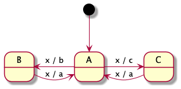

It's almost always a design flaw to do this, but these situations are usually easy to detect during design.

## Implementation of simple state machines.

(All code is intended to be written in standard C.  However, it has not been tested or even run through a compiler.  It should be looked at with some scepticism and generosity.  Where there are errors, I hope at least the intention is clear.  I'm going to ignore details like which declarations should go in which files and declaration before use.)

I'm going to take an object-oriented approach in that each state and transition will be represented by an object.  This may seem overly complicated. As we add features, this extra complexity will pay off.

### Representing states

There are actually three kinds of states in statecharts.  I'm only going to use 2 for now, but let's define all three.

~~~c
 typedef enum { BASIC, OR, AND } StateKindT ;
~~~

The definition of StateT here is complicated a bit by the fact that there are three kinds of states.  I'll explain each field as needed, so don't worry about all the weird fields just yet.

~~~c
typedef struct StateS StateT ;
...
typedef struct StateS {
    StateKindT kind ;
    char *pcName ;
    EventHandlerT *pEventHandler ;
    int childCount ;
    StateT **ppChildren ;    
    StateT *pParent ; 
    int depth ;    
    int index ;
    int activeChild ; }  ;
~~~

For our particular traffic light example we'll need 6 basic states.  In C struct members without an initializer are initialized to the default initial value, which here will be zero for ints and null for the pointers.  We'll initialize the first three fields. The `kind` field says that these are basic states.  The `pcName` field isn't used, but could be useful for debugging and testing.  The `pEventHandler` field will be explained after I've introduced the representations of events and transitions. 

~~~c
static StateT startState = { BASIC, "startState", startStateEH } ;
static StateT northSouthGreen = { BASIC, "northSouthGreen", northSouthGreenEH } ;
static StateT northSouthAmber = { BASIC, "northSouthAmber", northSouthAmberEH } ;
static StateT eastWestGreen = { BASIC, "eastWestGreen", eastWestGreenEH } ;
static StateT eastWestAmber = { BASIC, "eastWestAmber", eastWestAmberEH } ;
static StateT allRed = { BASIC, "allRed", allRedEH } ;
~~~

### Representing trees of states

We'll use something called an OR state that will represent the entire statechart as one object.  This root state is a sort of convenient fiction; the root will be an OR state from here on and for ever.   The reason to call this root a state will become clear later. 

~~~c
static StateT *(rootChildren[]) = { &startState, &northSouthGreen, &northSouthAmber, &eastWestGreen, &eastWestAmber, &allRed, (StateT*)0 } ;
static StateT  rootState = {OR, "root", doNothingEH, 6, rootChildren } ;
~~~

The fact that `startState` comes first is significant, as the initial state of an OR state is, by convention, at position 0. The order of the rest is arbitrary

By convention the child array is terminated with a null pointer.  This is redundant because we also have the `childCount`. But I'm going to use the null pointer to check that the programmer counted the states correctly and I'll use the count  to check that the programmer didn't forget to put in the null.

The states of a statechart form a tree.  In this example the root state has 6 children and that's it.  We should set all the parent links and the depth and index fields too. The `depth` field indicates how many jumps the node is from the root.  The `index` field records how many siblings precede the state in it's parent's `ppChildren` array. We'll do this with a function that just gets called once.  I'm going to write this as a recursive function, for reasons that will be clear later -- if they aren't yet.  We'll also check that the `childCount` fields are correct.

~~~c
void setParentsAndDepths( StateT *stateP, StateT *pParent, int depth, int index ) {
    stateP->pParent = pParent ;
    stateP->depth = depth ;
    stateP->index = index ;
    switch( stateP->kind )
    {
        case OR: case AND:
        {
            int i ;
            for( i = 0 ; stateP->childCount ; ++i ) {
                assertThat( (stateP->ppChildren)[i] != (StateT *)0 ) ;  /* Check that the count is not too big. */
                setParentsAndDepths( (stateP->ppChildren)[i], stateP, depth+1, i ) ; }
            assertThat( (stateP->ppChildren)[i] == (StateT *)0 ) ;  /* Check that the count is not too small. */
        } break;
        
        case BASIC : {
        } break ;
        
        default: { assertThat( false ) ; /* This should not happen. */ }
    }
}
~~~

The call to this function is always

~~~c
     setParentsAndDepths(  rootState, (StateT *)0, 0, -1 ) ;
~~~

### Representing events

We should have types for representing event classes.  The `TICK` event class is used to fire time events.  `TICK` events are associated with the time at which they happen.

~~~c
typedef struct EventS EventT ;
...
typedef enum {
    TICK,
    TIMER,
    EV_REC_APPROACHES,
    EV_REC_CLEAR
}  EventClassT ;

struct EventS {
    EventClassT tag ;
    union {
        int time ;
    } data ;
}  ;
~~~

Normally there would be more members in the union.  In this simple example only the `TICK` events are associated with extra data.

### Representing transitions

We need a type to represent transitions

~~~c
typedef struct TransitionS TransitionT ;
...
struct TransitionS {
    StateT *pSource ;
    ActionT *pAction ;
    StateT *pTarget ;
}  ;
~~~

For our example machine, we have the following transitions.

~~~c
TransitionT initTrans =  { &startState, &enterNorthSouthGreenAct, &northSouthGreen } ;

TransitionT northSouthGreen2AllRed =  { &northSouthGreen, enterAllRedAct, &allRed } ;
TransitionT northSouthGreen2northSouthAmber =  { &northSouthGreen, &enterNorthSouthAmberAct, &northSouthAmber } ;

TransitionT northSouthAmber2AllRed =  { &northSouthAmber, enterAllRedAct, &allRed } ;
TransitionT northSouthAmber2eastWestGreen =  { &northSouthAmber, &enterEastWestAmberAct, &eastWestGreen } ;

TransitionT eastWestGreen2AllRed =  { &eastWestGreen, &enterAllRedAct, &allRed } ;
TransitionT eastWestGreen2eastWestAmber =  { &eastWestGreen, &enterEastWestAmberAct, &eastWestAmber } ;

TransitionT eastWestAmber2AllRed =  { &eastWestGreen, enterAllRedAct, &allRed } ;
TransitionT eastWestAmber2NorthSouthGreen =  { &eastWestGreen, &enterNorthSouthGreenAct, &northSouthGreen } ;
    
TransitionT AllRed2NorthSouthGreen =  { &allRed, &enterNorthSouthGreenAct, &northSouthGreen } ;
~~~

### Representing actions

Actions are represented by functions so we have

~~~c
typedef  void ActionT( EventT *pEvent, TransitionT *pTrans ) ;
~~~

For our traffic light example we have:

~~~c
static void enterNorthSouthGreenAct( EventT *evt, TransitionT *trans ) { 
    st(20) ; ns(green) ; ew(red ) ; }
    
static void enterNorthSouthAmberAct( EventT *evt, TransitionT *trans ) { 
    st(5) ; ns(amber) ; }
    
static void enterEastWestGreenAct( EventT *evt, TransitionT *trans ) { 
    st(20) ; ew(green) }
    
static void enterEastWestAmberAct( EventT *evt, TransitionT *trans ) { 
    st(5) ; ew(amber) ; }
    
static void enterAllRed( EventT *evt, TransitionT *trans ) { 
    ns(green) ;  ew( green ) ; }
~~~

### Event handlers

Recall that each state has a `pEventHandler` field that contains a pointer to an `EventHanderT`. Event handlers are represented by functions that may pick a transition.

~~~c
typedef void EventHandlerT( EventT *evt, TransitionT **ppTransition ) ;
~~~

In our example, as is typical, each basic state has its own event handler. The convention is that the transition pointer is left alone if no transition is found.  Three examples should suffice.

~~~c
void startStateEH( EventT *pEvent, TransitionT **ppTransition )  {
    switch( pEvent->tag ) {
        case TICK: {
            *ppTransition = & initTrans ;
        } break ;
        default : {}
    }
}

void northSouthGreenEH( EventT *pEvent, TransitionT **ppTransition )  {
    switch( pEvent->tag ) {
        case TIMER: {
            *ppTransition = & northSouthGreen2northSouthAmber ;
        } break ;
        case EV_REC_APPROACHES: {
            *ppTransition = & northSouthGreen2AllRed ;
        } break ;
        default:  {}
    }
}
~~~

The root state's event handler is this

~~~c
void doNothingEH( EventT *pEvent, TransitionT **ppTransition )  {
}
~~~

### Setting the initial state

Before starting the mainLoop we need to initialize the statechart.

The `activeChild` field of a state is only used by OR states and indicates which child state is currently active.  The only transitions we need to consider are those out of active states.  The fundamental property of OR states is that: if an OR state is active then exactly 1 of the child states is also active.  The root state is always active, so for our simple state machine, it follows that there is exactly one active basic state, namely  the one with address `(*rootState.children)[ rootState.activeChild ]`.  We set `rootState.activeChild` to 0 because, by convention, the first child is the start state.

~~~c
void setInitialState( ) {
    resetState( & rootState ) ;
    }
~~~

For now all the reset state needs to do is set the `activeChild` to 0, since the initial states is by convention the first state.

~~~c
void resetState( StateT *pState ) {
/* Not the final version. */
    pState.activeChild = 0 ;
    }
~~~

### The main loop

Periodically we to process all events in an event queue

There are usually two ways that a system learns about events.  One is via interrupts, the other is by sensing.  When there is an interrupt.  The ISR can then put information about that event of a queue.  For sensing we usually have to ask the sensor for its input.  There might be another task that asks the sensor for its input and that adds an event to the queue if the input is interesting.  Or a statechart action can ask the sensor for input and add an event to its own 

So I'll assume that there is a queue that might hold events with function `tryPop`meaning try to pop an event into the buffer, and return `true` iff successful.

To make sure that transitions with `after(0s)` as trigger fire without undue delay, we inject one or more `TICK` events before and after each non `TICK` event. Later we'll see other uses of `TICK` events.

~~~c
void processAllEventsInTheQueue( StateT *rootState, QueueT q ) {
    EventT eventBuffer ;
    bool success ;
    while( true ) {
        /* Inject TICK events until the machine is stable.*/
        do {
            makeATickEvent( &event ) ;
            success = false ;
            findAndDoTransitions( &rootState, &eventBuffer, &success ) ;
        } while( success ) ;

        /* Look to the queue for an event to process */
        notEmpty = tryPop( queue, &eventBuffer ) ;

        if( ! notEmpty ) break ;

        /* Process the event. */
        findAndDoTransitions( &rootState, &eventBuffer, &success ) ;
        if( ! success ) {
            logLostEvent( &eventBuffer ) ;
        }
    }
}
~~~

`findAndDoTransitions` works like this.  Keep in mind that the root state is an OR state and everything else is a BASIC state, so far.  The policy for the success flag is to leave it alone unless the event generates at least one transition.

~~~c
void findAndDoTransitions( StateT *pState, EventT *pEvent, bool *pSuccess ) {
   bool localSuccess = false ;
    switch( pState->kind ) {
    case BASIC : {
        ...
    } break ;
    case OR : {
        ...
    } break ;
    case AND : {
        ...
    } break ;
    default: assertThat( false ) ; 
    
    /* Now all the active children have had a crack. localSuccess should be true
        if and only if at least one active descendant state handled the event. */
        
    if( localSuccess ) {
        *pSuccess = true ;
    else {
        /* Try this state's handler */
        TransitionT pTransition = (TransitionT*)0  ;
        EventHandler *handler = pState->pEventHandler
        handler( pEvent,  & pTransition ) ;
        if( pTransition != (TransitionT*)0 ) {
            doTransition( pEvent, pTransition ) ; 
            *pSuccess = true ; }
      }
}     
~~~

Processing a basic state is easy.  We leave the `localSuccess` flag false and so the basic state's event handler will be given a chance to find a transition.

~~~c
    case BASIC : {
    } break ;
~~~

For the root state (or any other OR state), we delegate processing to the currently active child. Otherwise, we try the handler for the OR node itself.

~~~c
    case OR : {
        /* Delegate to the active child. */
        StateT *pChild = (pState->children)[ pState->activeChild ] ;
        findAndDoTransitions( pChild, pEvent, &localSuccess ) ;
    } break ;
~~~

If the active state did not handle the event, then `localSuccess` will be left as `false` and so, after the `switch` command, the handler of the OR state will be given a chance to handle the event.  In a simple state machine, the only OR state is the root and its handler does nothing, so in this case `findAndDoTransition` does nothing at all.  On the other hand, if the active state did handle the event, then then `localSuccess` will be set to true in the recursive call and so, after the switch statement, all that happens is that `*pSuccess` is set to true.

We'll come back to AND nodes when needed.

There are a few loose ends to tie up.  One is `doTransition`. For now this will be very simple.

~~~c
void doTransition( EventT *pEvent, TransitionT *pTransition )  {
    /* Not the final version. */
    ActionT *action = pTransition->action ;

    exitState( pTransition->pSource ) ;
    
    action( pEvent, pTrans ) ;
    
    enterState( pTransition->pTarget ) ;
}
~~~

For now `exitState` does nothing and `enterState`, as mentioned sets the `activeChild` of its first argument to the index of its second.  

~~~c 
void exitState( StateT *pState, StateT *pContext ) {
     /* Not the final version. */
}

void enterState( StateT *pState) {
     /* Not the final version. */
     assertThat( pContext == pState->parent ) ;
     assertThat( pContext->tag == OR ) ;
     pContext->activeChild = pState->index ;
}
~~~

## Entry and Exit actions

We can associate "entry" and "exit" actions with each state.  This often allows us to simplify the transitions into and out of the states and to make statecharts easier to read.  In the case of our traffic light example, we can eliminate the `Start` state, since its only purpose was to ensure that the lights are set appropriately on entering the `NorthSouthGreen` state.  We get this machine:

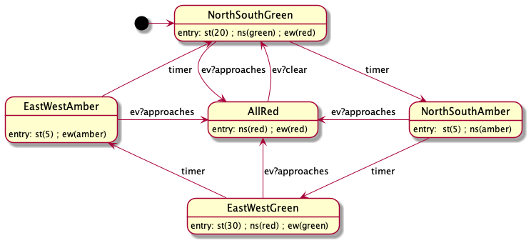

## Implementing Entry and Exit actions

We can add entry and exit actions to our states

~~~c
typedef struct StateS {
    StateKindT kind ;
    char *pcName ;
    EventHandlerT *pEventHandler ;
    ActionT *pEntryAction ;  /* NEW */
    ActionT *pExitAction ;  /* NEW */
    int childCount ;
    StateT **ppChildren ;    
    StateT *pParent ; 
    int depth ;    
    int index ;
    int activeChild ; } StateT ;
~~~

We modify the `enterState` and `exitState` methods.

~~~c 
void exitState( StateT *pState ) {
     /* Not the final version. */
     (pState->pExitAction)() ;
}

void enterState( StateT *pState) {
     /* Not the final version. */
     StateT pParent == pState->parent ;
     assertThat( pParent->tag == OR ) ;
     pParent->activeChild = pState->index ;
     (pState->pEntryAction)() ;
}
~~~

We also want to make sure that the entry action for the initial state happens at the beginning.  I'm going to do that with some gratuitous recursion.

~~~c
void resetState( StateT *pState ) {
    (pState->pEntryAction)() ;
    switch( pState->kind) {
    
        case BASIC: {
        } break ;
        
        case OR: {
            pState->activeChild = 0 ;
            StateT *startState = (pState->children)[ 0 ] ;
            resetState( startState ) ;
        } break ;
        
        case AND: {
            /* Covered later */
        } break ;
        
        default: { assertThat( false ) ; }
}
~~~

## Nested OR states

One way that Statecharts help us is by allowing states to be nested.  So the set of states will make a tree.  We've already seen that there is a conceptual OR node at the root.

Here is an example with an OR node that is not the root.

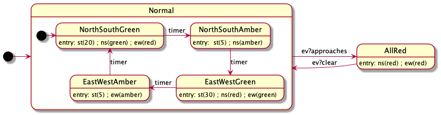

There are significantly fewer transitions.   Generally nesting states helps to keep complex machines reasonably concise and readable.

Nesting creates some issues.  The first that the machine can now be "in" multiple states at the same time.  I.e., more than one state can be active.   The rule for OR states is

* If an OR state is active, exactly one of its children is active.
* If an OR state is not active, none of its children are active.

In our example, when `Normal` is active, exactly one of its four children will be active. And when `AllRed` is active, no other state is active except the root state. The root is an OR state that is always active (after initialization), so either `AllRed` or `Normal` will be active, but never both at the same time.

When `Normal` is active an `ev?Approaches` event will change the active state of the root to `AllRed`, meaning that not only does `Nomal` become inactive, but also its active substate.

The transition from `AllRed` to `Normal` is interesting because it doesn't indicate which child of `Normal` should be active.  So it will be the start state for `Normal`, which is `NorthSouthGreen`.

If the designers decided that it is better to go from `AllRed` to a different state that can be done like this: 

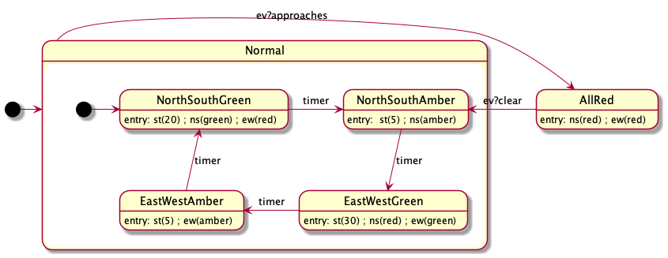

This is an example of an interlevel transitions. It's usually good advice to avoid them, but sometimes they are very useful.

What does this mean for entry and exit actions?

Consider this example

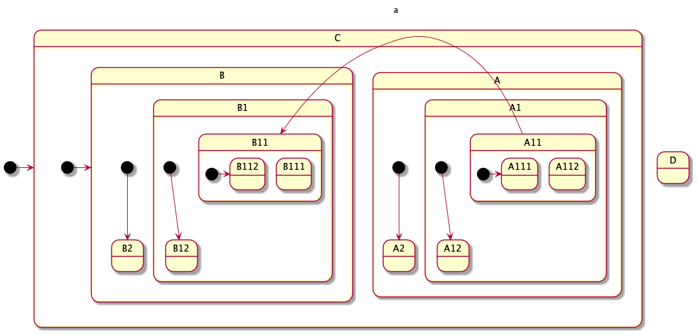

Suppose the active states are {C, A, A1, A11, A112} and the transition happens.  The states {A, A1, A11, A112}, but not C, are all exited, so their exit actions must take place.  Then the states {B, B1, B11, B112} need to be entered, so their entry actions are executed.  B112 is entered of course because it's the start state for B11.  Exits should happen bottom-up. Entries should happen top-down.  

> Exit actions: A112, A11, A1, A  
> Transition actions  
> Entry actions: B, B1, B11, B112

Another issue that comes up with nesting is the priority of conflicting transitions.  We already saw that when there are conflicting transitions out of an active state, the choice is undefined.  But now there can be more than one active state, the priority goes to transition with the deepest source state that can fire.  For example here the priority goes to the transition out of A11 if A11 is active.

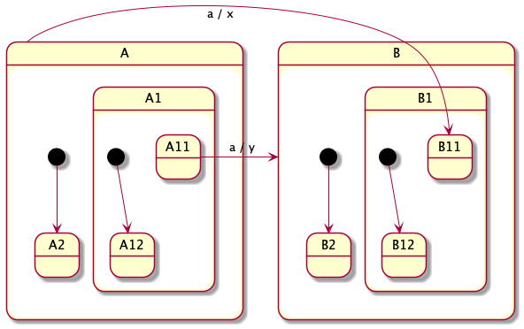

## Implementing Nested OR states

Much of the work is already done.  Because of the recursion in `setParentsAndDepths` the tree will be properly built regardless of the nesting depth.  The most recent version of `resetState` is also recursive and ensures that the entry actions are done initially in a top down manner.

However we need to fix up `doTransition` so that it will exit all the states that need to be exited and enter all the states that need to be entered.

The key idea is that for each transition there is some OR state (possibly the root state) that in a sense the home for that transition.  This is the lowest OR node that is a common ancestor of both the source and the target.  Consider this example again:

The home for the transition is C.  I'll call this the lowest common ancestral OR state (LCAO). (Of course the least common ancestor can only be an OR state; but later we'll introduce AND state nodes and then it could conceivable be an AND state, we want an OR state, so I'll insist on it being an OR state.)

* All active states below the LCAO need to be exited.  We'll exit these states in two phases.  First we exit all active states below and equal to the source state, then we exit all states from the source's parent up to but, but not including the LCAO.
* Then we do the action associated with the transition.
* Then we need to enter all the newly active states. These are also all below the LCAO. Again there are two phases.  First enter all the states from (but not including the LCAO) down to and including the target state. Second enter the default start states on a path down until we hit a basic states.  As just before entering the child of an OR state, we adjust the OR state's active child.

It is important that there are never transitions into or out of the root because such a transition would not have an LCAO.

The first thing to do is to find the LCAO for a transition.  This is the reason we want the `depth` field.

~~~c
StateT* findLCAO( TransitionT *pTrans ) {
    StateT* pSource = pTrans->pSource ;
    StateT* pTarget = pTrans->pTarget ;
    while( pSource->depth > pTarget->depth ) pSource = pSource->parent ;
    while( pTarget-->depth > pSource->depth ) pTarget = pTarget->parent ;
    assertThat( pSource->depth ==  pTarget-->depth ) ;
    while( pSource->parent != pTarget->parent || pSource->parent->kind != OR ) {
        pSource = pSource->parent ;
        pTarget = pTarget->parent ; }
    assertThat( pSource->parent == pTarget->parent && pSource->parent->kind == OR ) ;
    return pSource->parent ; }
~~~

Now we need to modify `doTransition`.

~~~c
void doTransition( EventT *pEvent, TransitionT *pTransition )  {
    StateT *pSource = pTransition->pSource ;
    StateT *pTarget = pTransition-> pTarget ;
    StateT * pLCAO = findLCAO( pTransition ) 
    
    ActionT *action = pTransition->action ;

    exitState( pSource, pLCAO ) ;
     
    action( pEvent, pTrans ) ;
    
    enterState( pTarget, pLCAO ) ;
}
~~~

Now we need to modify `exitState` and `enterState`. 

~~~c 
void exitState( StateT *pState, StateT * pLimit ) {
     /* Exit pState and any below it */
     exitBelow( pState ) ;
     /* Exit all the states above pState up to but not including the limit. */
     exitAbove( pState->pParent, pLimit, pState->index ) ;
}

void exitAbove( StateT *pState, StateT *pLimit, int index) {
     if( pState == pLimit ) {
          /* Do nothing */  }
     else {
         (pState->pExitAction)() ; }
         exitAbove( pState->pParent, pLimit, pState->index ) ;
     }
}

void enterState( StateT *pState, StateT *pLimit) {
     /* Enter all the states above pState up to but not including the limit. */
     enterAbove( pState->pParent, pLimit, pState->index ) ;
     /* Enter pState and any below it */
     resetState( pState ) ;
}

void enterAbove( StateT *pState, StateT * pLimit, int index) {
     /* Go upward to the limit.
         On the way back down, enter each of these states (not including the limit)
         and set the active child of OR states to the child on the path we are travelling.
     */
     switch( pState->kind) {
     case OR: {
         pState->activeState = index ;
     } break ;
     
     case AND : {
         /* Covered later. */
     } break ;
     
     default : assertThat( false ) ;
     }
     if( pState == pLimit ) {
          /* Do nothing */ }
     else {
         enterUp( pState->pParent, pLimit, pState->index ) ;
         (pState->pEntryAction)() ; }
     }
     
     /* Going down */
     switch( pState->kind) {
     case OR: {
         pState->activeState = index ;
     } break ;
     
     case AND : {
         /* Covered later. */
     } break ;
     
     default : assertThat( false ) ;
     }
}
~~~

`exitBelow` is similar to `resetState` except that it is for exiting rather than entering.  Whereas in `resetState` the `activeChild` index of OR states is set to 0, here we leave the `activeChild` index alone, but use it to guide the path of the downward recursion.

~~~c
void exitBelow( StateT *pState ) {
    switch( pState->kind) {
    
            case BASIC: {
            } break ;
            
            case OR: {
                StateT *activeChild = (pState->children)[ pState->activeChild ] ;
                exitBelow( activeChild ) ;
            } break ;
            
            case AND: {
                /* Covered later */
            } break ;
            
            default: assertThat( false ) ;
        }
        
        (pState->pExitAction)() ;
}
~~~

## AND states

At last we come to AND states.  AND states provide concurrency.  Like an OR state, an AND state has a set of children.  But the rule for AND states is that:

* If an AND state is active, all of its children are also active.
* If an AND state is not active, none of its children are active.

AND states are drawn as states divided up into 2 or more "regions" by dotted lines.  Each region is an OR state and so should have at least one child.  Here is an example of a statechart in  UML notation with both AND states and OR states.

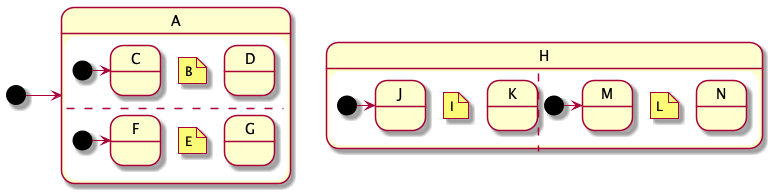

In PlantUML (which I'm using to make the pictures), there doesn't seem to be a way to give names to regions, so I've included the names as notes for clarity.  At any time the set of active states could be any of the following

* {root, A, B, C, E, F}
* {root, A, B, C, E, G}
* {root, A, B, D, E, F}
* {root, A, B, D, E, G}
* {root, H, F, J, L, M}
* {root, H, F, J, L, N}
* {root, H, F, K, L, M}
* {root, H, F, K, L, N}

Here is a tree diagram showing the states of the previous statechart as tree.

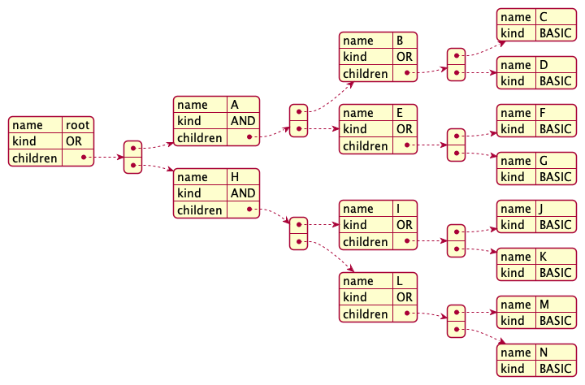

The combination of AND and OR states allows us to model complex concurrent systems in a modular way. If we were to rewrite a statechart with N states, as a simple state machine, this could require up to O(2^N) states.   Consider a city with 100 traffic lights.  At any point in time each light could be in one of 5 configurations.  Thus the total number of configurations is 5^100 which is over 7 x 10^69.  Yet our statechart would need only 500 basic states.

**Aside** on terminology and the meta-model.  What I call a "BASIC state", the UML standard calls a "simple state"; what I call an "AND state", the UML standard calls a "composite state"; and what I call an "OR state" the UML standard calls a "region".  UML also has a kind of state called a "submachine state", which I'm ignoring.  In the standard "regions" aren't really states; and there is a strict alternation so that composite states contains only regions and regions contain only "simple", "composite", and "submachine" states.  That sometimes means that UML diagram need "composite states" that have only one child, whereas in our model, an AND state with only one child is never needed.  (Composite states with more than one child are called "orthogonal states" in the standard.) Furthermore, in UML there might be a region with only one child, whereas, in our model there is (almost) never a need to have an OR state with only one child.  My terminology and model is based on von der Beeck's paper [2], which is based on Harel's model and terminology [1]. **End aside.**

With concurrent states we can have a situation like this:

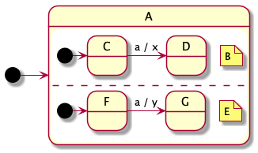

If the active states are {root, A, B, C, E, F} and an `a` event is processed what should happen? 

The obvious choices are that one of the transitions fire or that they both fire.  Statecharts use a "broadcast" model, meaning that events are processed by all the children of an AND state, but the order of processing is not defined.  So, in this example, either of the following sequence of actions should happen:

*  Exit C, x Enter D, Exit F, y, Enter G, or
*  Exit F, y, Enter G, Exit C, x Enter D.

In either case the set of active states after the event is processed will be {root, A, B, D, E, G}.

Transitions into and out of AND states are interesting, but basically logical.  Consider these transitions

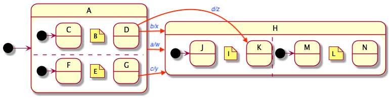

Suppose the active states are {root, A, B, D, E, G}.  Any of the four transitions can happen

* `a`. In this case A must be exited, so B and E must exited, so D and G must be exited.  All this happens in postfix order. But exits from the AND's children could happen in either order.  So the order of exits is either
     * D, B, B, E, A or G, E, D, B, A.
     * After all these exits, the transition action happens.
      * Next, H is entered and so I and L must be entered and so J and M are entered.  Now it's prefix order, but the order that the children of the AND are entered is nondeterministic. So the possible orders are
      * H, I, J, L, M or H, L, M, I, J
* Events `c` and `d` are similar.
* Event `d` is similar, except that J is entered instead of K.

By the way PlantUML can't handle transition in and out of regions. That's why the last figure looks a bit doctored.  It's legit UML, but Plant UML just doesn't cope with them.  You can use composite transitions instead in the diagram.  I'm not dealing with composite transitions in this document.  For more information see the PlantUML documentation.

## Implementing AND states

At long last we implement AND states.  `resetState` needs to reset all children of an AND state

~~~c
void resetState( StateT *pState ) {
    (pState->pEntryAction)() ;
    switch( pState->kind) {
    
        case BASIC: {
        } break ;
        
        case OR: {
            pState->activeChild = 0 ;
            StateT *startState = (pState->children)[ 0 ] ;
            resetState( startState ) ;
        } break ;
        
        case AND: {
            for( int i=0 ; i < pState->childCount; ++i ) {
                StateT *pChild = (pState->children)[ i ] ;
                resetState( pChild ) ;
            }
        } break ;
        
        default: { assertThat( false ) ; }
}
~~~

For `findAndDoTransitions`, the event is sent to all children.  If none of them handle the event, then the AND state itself can try.

~~~c
void findAndDoTransitions( StateT *pState, EventT *pEvent, bool *pSuccess ) {
   bool localSuccess = false ;
    switch( pState->kind ) {
    case BASIC : {
    } break ;
    case OR : {
        /* Delegate to the active child. */
        StateT *pChild = (pState->children)[ pState->activeChild ] ;
        findAndDoTransitions( pChild, pEvent, &localSuccess ) ;
    } break ;
    case AND : {
        /* Delegate to each child. */
       
        for( int i=0 ; i < pState->childCount; ++i ) {
              StateT *pChild = (pState->children)[ i ] ;
              findAndDoTransitions( pChild, pEvent, &localSuccess ) ;
         }
    } break ;
    default: assertThat( false ) ; 
    
    /* Now all the active children have had a crack. localSuccess should be true
        if and only if at least one active descendant state handled the event. */
    if( localSuccess ) {
        *pSuccess = true ;
    else {
        /* Try this state's handler */
        TransitionT pTransition = (TransitionT*)0  ;
        EventHandler *handler = pState->pEventHandler
        handler( pEvent,  & pTransition ) ;
        if( pTransition != (TransitionT*)0 ) {
            doTransition( pEvent, pTransition ) ; 
            *pSuccess = true ; }
      }
}     
~~~

For `exitAbove`, when we reach an AND state, the child at position `index` will have already been exited.  All the other children should be exited before the AND node is exited.

~~~c
void exitAbove( StateT *pState, StateT *pLimit, int index) {
     if( pState == pLimit ) {
          /* Do nothing */  }
     else {
         if( pState->kind == AND ) {
            for( int i=0 ; i < pState->childCount; ++i ) {
                  if( i != index ) {
                      StateT *pChild = (pState->children)[ i ] ;
                      exitBelow( pChild ) ; } }
             (pState->pExitAction)() ; }
             exitAbove( pState->pParent, pLimit, pState->index ) ;
         }
     }
}
~~~

For `exitBelow`, we need to exit all the children of an AND state before doing the exit action.

~~~c
void exitBelow( StateT *pState ) {
    switch( pState->kind) {
    
            case BASIC: {
            } break ;
            
            case OR: {
                StateT *activeChild = (pState->children)[ pState->activeChild ] ;
                exitBelow( activeChild ) ;
            } break ;
            
            case AND: {
                for( int i=0 ; i < pState->childCount; ++i ) {
                    StateT *pChild = (pState->children)[ i ] ;
                    exitBelow( pChild )
                }
            } break ;
            
            default: assertThat( false ) ;
        }
        
        (pState->pExitAction)() ;
}
~~~

Finally we get to `enterAbove` which, on the way down, must reset all children except for the one that was visited previously on the way up.

~~~c
void enterAbove( StateT *pState, StateT * pLimit, int index) {  
     /* Go upward to the limit.
         On the way back down, enter each of these states (not including the limit).
         For OR states set the active child. For AND states reset the other children.
         .
     */
     if( pState == pLimit ) {
          /* Do nothing */ }
     else {
         enterUp( pState->pParent, pLimit, pState->index ) ;
         (pState->pEntryAction)() ;  }
         
     /* At the top and on the way back down. */
     switch( pState->kind) {
     case OR: {
         pState->activeState = index ;
         } break ;
     
     case AND : {
            for( int i=0 ; i < pState->childCount; ++i ) {
                  if( i != index ) {
                      StateT *pChild = (pState->children)[ i ] ;
                      reset( pChild ) ; }
             }
         } break ;
     
     default : assertThat( false ) ;
     }
}
~~~

Examples

Consider the transition on a `d` signal from the previous example.  `doTransition` takes the following 5 steps:

* `exitBelow` is called on the source, D. That exits D.
* `exitAbove` is called on the source's parent, B. It recurses up to A and then the root.  On the way up:
    * At B it exits B.
    * When it reaches A, it exits all children of A except B, so that exits E (and hence first F or G).  
    * When it reaches the root the upward trip stops.
    * Nothing interesting happens on the way down.  (This is a tail recursion and could be rewritten as a loop.
* The transition actions happen.
* `enterAbove` is called on the target's parent, I.  This recurses up the tree to I, H, and the root.  On the way back down:
    * At the root, the active child is set to the index of H.
    * At H, H is entered, then all the children other than I are reset. So that enters L and then M.
    * At I, I is entered, and then the active child is set to the index of K.
* `enterBelow` is called on the target, K. K is entered.

Now consider the transition on an `a` signal. I'll assume the initial active states are {root, A, B, C, E, G}.  `doTransition` again takes 5 steps:

* `exitBelow` is called on the source which is A. The causes an exit of C, B, G, E, and finally A. (Assuming B is child 0.)
* `exitAbove` is called on the source's parent, which is the root.  This has no effect.
* The transition action `w` happens.
* `enterAbove` is called on the target's parent, which is the root.  All this does is set the active child of the root state to the index of H.
* `enterBelow is called on the target H. This causes entry of H, I, J, L, and M. (Or H, L, M, J, and L).

## Other features that are useful and easy to support

### Guards 

Guards are boolean expressions written in a transition's label. The syntax for labels is now

The syntax for transition labels, so far, is one of

> *trigger* / *sequenceOfActions* 
> *trigger*  
> *trigger* [ *guard* ] / *sequenceOfActions* 
> *trigger* [ *guard* ]

So far, the syntax of triggers is one of

> *signalName*  
> `after( 0s )`

A guarded transition will only fire if the guard is true.  When more than one transition out of a state is labelled with the current signal, and more than one of those has a true guard, there is a conflict and the choice between the transitions is arbitrary.  Consider this example.

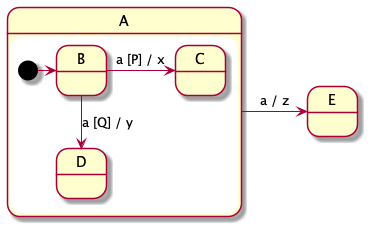

If the active states are `A` and `B`, and an `a` signal is processed

* If `P` is true and `Q` is false, then the transition to `C` will happen.
* If `Q` is true and `P` is false, then the transition to `D` will happen.
* If both are true, one (but not the other) of these two transitions will happen.
* If both are false, the transition to `E` will happen.

### Implmenting guards

Guard's are easy to implement by adding if-else statements to the event handlers, like this. 

~~~c
void stateA_EH( EventT *pEvent, TransitionT **ppTransition )  {
    switch( pEvent->tag ) {
        case A: {
            *ppTransition = & trans_A_to_E_doing_z ;
        } break ;
        default : {}
    }
}

void stateB_EH( EventT *pEvent, TransitionT **ppTransition )  {
    switch( pEvent->tag ) {
        case A: {
            if( P ) { *ppTransition = & trans_B_to_C_doing_x ; }
            else if( Q ) { *ppTransition = & trans_B_to_D_doing_y ; }
        } break ;
        default : {}
    }
}
~~~

In this case there was an arbitrary decision to prefer the transition to `C` over the transition to `D`.  The if either of `P` or `Q` are true, then `stateA_EH`
won't be called because we have already implemented priority of transitions out of children over transitions out of their ancestors.

### Branching with choice pseudo-states

Branching uses "choice" pseudo-states, which are drawn as diamond shaped nodes. There is usually one transition coming in and multiple transitions coming out of the diamond. The transitions coming out can not be labelled with a trigger and normally have guards.

Pseudo-states are not states, in that the machine never rests in a pseudo-state. 

Let's consider this example and compare it with the guards example above.

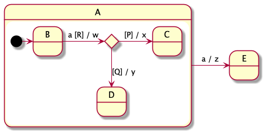

Again suppose the active states are `A` and `B`and and `a` signal happens.

* If `R` is false, the transition out of `B` can't be taken, so the transition from `A` to `E` is taken: `B` is exited, `A` is exited, action `z` happens and `E` is entered.
* If `R` is true, the transition out of `B` must be taken. `B` is exited and action `w` happens. However, as we have not reached a state yet, the event processing is not finished.  So now `P` and `Q` are evaluated. Note that `R` is evaluated before action `w`, whereas `P` and `Q` are evaluated after.

    * If `R` is true, `P` is true, and `Q` is false, the transition to `C` is taken, so action `x` happens and `C` is entered.
    * If `R` is true, `Q` is true, and `P` is false, the transition to `D` is taken, so action `y` happens and `D` is entered.
    * If `P`, `Q`, and `R` are all true, there is an arbitrary choice between the two transitions out of the pseudo-state.
    * The remaining possibility is that `R` is true and both `P` and `Q` are false. The UML standard says that if this can happen, the model is "consider ill formed"; in other words there is an error.

To make it easy to avoid the sort of design error just mentioned, there is a special guard `else` that means the negation of all the other guard out of the same choice pseudo state.

The transitions from `B` to `C` and `D` in the above example are examples of "compound transitions". 

### Implementing branching with choice pseudo-states

Compound transitions don't really fit into the way we are implementing statecharts. I may look at them more later.

However, provided (a) there is no action on any edge that goes into a choice pseudo state and (b) the LCAO of source and target states is the same as the LCAO of the choice pseodo-state and the target state, we can deal with choices without any change to the implementation approach.  Consider this machine (which also illustrates how choice nodes can have mulitple entries).

(Condition (b) above is to ensure that the actions happen at the correct time with respect to the entry and exit actions. When there aren't entry and exit actions, it can)

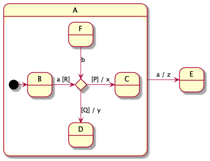

We can implement the event handlers for `A`, `B`, and `F` like this:

~~~c
void stateA_EH( EventT *pEvent, TransitionT **ppTransition )  {
    switch( pEvent->tag ) {
        case A: {
            *ppTransition = & trans_A_to_E_doing_z ;
        } break ;
        default : {}
    }
}

void stateB_EH( EventT *pEvent, TransitionT **ppTransition )  {
    switch( pEvent->tag ) {
        case A: {
            if( R ) {
                if( P ) {
                    *ppTransition = & trans_B_to_C_doing_x ; }
                else if( Q ) {
                    *ppTransition = & trans_B_to_D_doing_y ; }
                else {
                    assertThat(false) ; } }
        } break ;
        default : {}
    }
}

void stateF_EH( EventT *pEvent, TransitionT **ppTransition )  {
    switch( pEvent->tag ) {
        case B: {
            if( P ) {
                *ppTransition = & trans_F_to_C_doing_x ; }
            else if( Q ) {
                *ppTransition = & trans_F_to_D_doing_y ; }
            else {
                assertThat(false) ; } }
        } break ;
        default : {}
    }
}
~~~

### in and not in

Two guards that are sometimes used are `[in S]` and `[not in S]` where S is the name of state. The first is true iff S is active. 

Here is an example where the choice between transitions in one state is determined by  the situation in a concurrent state.

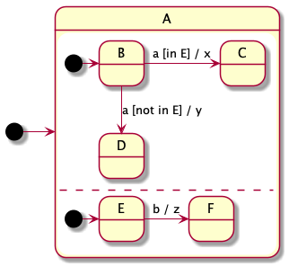

To implement "in" and "not in", we can write an `in` function to tell whether a state is active or not.

### A warning about "in" and "not in"

Conceivably you could have two transitions fire concurrently.  In this case our implementation might leave a state before another transitions guard is evaluated. I'm not sure this is good UML, but the behaviour of our implementation will depend on the order the transitions fire, which is probably not good.

Consider this example, if the active states are `A`, `B`, and `D` and an `a` signal happens, then, with the proposed implementation, only one of the transitions will happen and which one will happen depends on the order that the children of `A` happen to be in. 

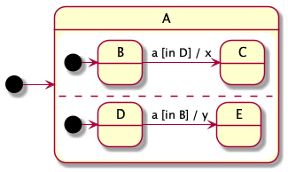

A similar issue comes up with other guards that might be affected by actions of other, concurrent, transitions.

Anyway, it would be weird for this sort of case to come up, but it could.

### Internal communication

#### Shared variables

The children on an AND node can be thought of as concurrently executing "pseudo threads". I'm calling them pseudo threads because there is no multithreading in the traditional sense and, in particular there is no pre-emption. Each transition executes as an atomic action with respect to any other transitions in the machine.

This means that pseudo threads can safely communicate by means of shared variables like this.

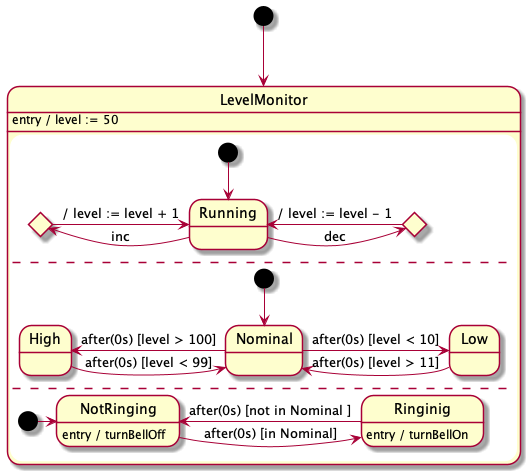

Here there are three pseudo-threads. The top pseudo-thread maintains increments and decrements shared variable `level`. (The use of choice pseudo-states here is gratuitous -- I only used the pseudo-states because PlantUML does a lousy job when more than one transition forms a loop on a state.) The middle pseudo-thread reads `level` and classifies the value of level into three buckets. The bottom pseudo-thread abstracts the three buckets into two and controls an alarm.

So a shared variable `level` is used to communicate here between the top and middle pseudo-threads.

#### Internal signals

Another way for pseudo-threads to communicate is by firing signals. For example

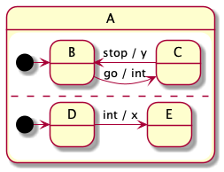

Here if the active states are {`A`, `B`, `D`} and a `go` signal happens, first there will be a transition to {`A`, `C`, `D`}. The action here is `int`, which is also an signal. Executing `int` as an action queues an `int` signal. This will cause a subsequent transition from `D` to `C`.

Note that this is an asynchronous communication betweent the pseudo states.  In David Harel's original statechart semantics, internal communications like this were synchronous, meaning that there would be an immediate transition from {`A`, `B`, `D`} to {`A`, `C`, `E`}.  This makes a lot of sense if you are modelling clocked digital hardware, where the entire transition can be made from one clock cycle to the next.  Later, when Harel developed the statechart tools for software, he introduced the asynchronous interpretation.

In UML statecharts, the order that events are processed is not defined. Suppose that a `go` and `stop` message arrive in quick succession. Both will be queued. If the `go` message is processed first, it will create an `int` signal, which is also queued. Whether the `int` or `stop` signal is processed next is not defined by the UML standard. So the sequence of transitions could be either

* $\{{\tt A},{\tt B},{\tt D}\}\stackrel{{\tt go / int}}{\longrightarrow}\{{\tt A},{\tt C},{\tt D}\}\stackrel{{\tt int / x}}{\longrightarrow}\{{\tt A},{\tt C},{\tt E}\}\stackrel{{\tt stop / y}}{\longrightarrow}\{{\tt A},{\tt B},{\tt E}\}$ or
* $\{{\tt A},{\tt B},{\tt D}\}\stackrel{{\tt go / int}}{\longrightarrow}\{{\tt A},{\tt C},{\tt D}\}\stackrel{{\tt stop / y}}{\longrightarrow}\{{\tt A},{\tt B},{\tt D}\}\stackrel{{\tt int / x}}{\longrightarrow}\{{\tt A},{\tt B},{\tt E}\}$.

### More on triggers

A trigger is what determines whether a transition can proceed, so far we've only seen one kind of trigger which is an *signalName*; there are other possibilities.  The syntax of transition labels is one of

> *trigger* / *sequenceOfActions* 
> *trigger*  
> *trigger* [ *guard* ] / *sequenceOfActions* 
> *trigger* [ *guard* ]

Wnere a *trigger* is one of

> *call event*  
> *signal event*  
> *any recieve event*  
> *change event*
> *time event*

Of these

* *signal event*. The simplest form of a *signal event* is just a *signalName*, which we've seen a lot of.  I'll look at the other cases below.
* *time event* is dealt with next.
* *change event*. I'm going to ignore these, since I'm not sure I understand them.
* *call event*. I'm going to ignore these, since they are mostly useful for describing classes in OO programming.
* any recieve event*. I'm going to ignore these.

### Time events.

There are two kinds of time event. The first looks like this

> `after(` *duration* `)`

where the duration is something like `0s` or `45ms`.  The corresponding time event happens when that much time has elapsed since the source state was entered.

The second kind is look like this

> `at(` *time* `)`

Where *time* indicates some specific time. A sensible way to do this is to use some specific time (like 00:00GMT on Jan 1, 1970) as an origin and specify the time as the number of miliseconds since then.  Or you could use the time of the last boot as time 0.

### Implementing time expressions

Recall that events have an optional `time` field. This will be set to the current time for each `TICK` event.

Let's first deal with `after(` *duration* `)`. Say there is a transition out of state `s42` with a `after( 45ms )` as its trigger.  Then in in the entry action set a variable `s42EntryTime` to the current time in miliseconds.  In the event handler for `s42` on its `TICK` event, compare the current time to `s42EntryTime + 42`. I.e.

> `eventP->data.time >= s42EntryTime + 42`

 If the current time is greater or equal to `s42EntryTime + 42`, then the transition is selected.  As a special case, an event `after( 0s )` is always selected on a `TICK` event.

One way to deal with `at(` t `)` is simply to compare the current time with the given time for equality with each tick event: `eventP->data.time == t`.  The danger is that if the condition isn't checked frequently enough, then the event could be missed. An alternative is to compare for greater or equal: `eventP->data.time >= t`.  Here the danger is that the event might happen long after the given time and the event might keep happening again and again. A compromise is to use and expression such as

> `t <= eventP->data.time && eventP->data.time < t+fuzz`

where `fuzz` is some carefully chosen constant. This, in a sense, combines the faults of both the previous approaches.

Perhaps it is best to avoid `at( t )`.

### Signals with parameters

Signals are often parameterized, especially when the signal corresponds to a message being received from some other system. The syntax for signal triggers is one of

> *signalName*    
> *signalName* `(` *paramName* `)`   
> *signalName* `(` *paramName*, *paramName* `)`   
> *signalName* `(` *paramName*, *paramName*, *paramName* `)`   
> etc.

The parameter values can be stored in fields of the event obejects. For example, suppose that a signal class called `POSITION_REPORT_EC` has parameters `lat`, `lon`, and `alt`, we can make the the EventS structure like this

~~~c
typedef struct PositionReportS PositionReportT ;
struct PositionReportS {
    double lat ;
    double lon ;
    double alt ;
}

typedef struct EventS EventT ;
...
typedef enum {
    TICK,
    POSITION_REPORT_EC,
    ...etc...
}  EventClassT ;

struct EventS {
    EventClassT tag ;
    union {
        int time ;
        PositionReportT position ;
        ...etc...
    } data ;
}  ;
~~~

Since the action functions are passed the event, they can access the parameters.

### History

An OR state can contain a "shallow history" and/or "deep history" pseudo state. Transitions from outside the OR state can end at a pseudo-state.

* If the transition ends at a shallow history pseudo-state then the target of the transition is the latest child of the OR state to be active.
* If the transition ends at a deep history pseudo-state, then the target of the transition is the latest descendant of the OR state to be active.

### Implementation of History

To each transition add a field that holds one of three enumeration values `NO_HISTORY`, `SHALLOW_HISTORY`, or `DEEP_HISTORY`.  If the history field is not `NO_HISTORY`, the target state must be an OR state.

~~~c
struct TransitionS {
    StateT *pSource ;
    ActionT *pAction ;
    StateT *pTarget ;
    HistoryT history ;
} ;
~~~

Now modify `doTransition`:

~~~c
void doTransition( EventT *pEvent, TransitionT *pTransition )  {
    ... as before ...

    enterState( pTarget, pLCAO, pTransition->history ) ;
}
~~~

Modify `enterState`

~~~c
void enterState( StateT *pState, StateT *pLimit, HIstoryT history) {
    if( history == DEEP_HISTORY ) {
        assertThat( pState->kind == OR ) ;
        /* Enter all the states above pState up to but not including the limit. */
        enterAbove( pState->pParent, pLimit, pState->index ) ;
        /* Enter the state and its active children without
        resetting the activeChild fields */
        reenterState( pState ) ;
    } else {
        if( history == SHALLOW_HISTORY ) {
            assertThat( pState->kind == OR ) ;
            pState = pState->children[ pState->activeChild ] ;
        } else
            assertThat( history == NO_HISTORY ) ;
        /* Enter all the states above pState up to but not including the limit. */
        enterAbove( pState->pParent, pLimit, pState->index ) ;
        /* Enter pState and any below it. */
        resetState( pState ) ;
    }
}
~~~

Finally we need a `reenterState` function that is much like the `resetState`, but that doesn't change the active children.  This was used for `DEEP_HISTORY`.

~~~c
void reenterState( StateT *pState ) {
    (pState->pEntryAction)() ;
    switch( pState->kind) {
    
        case BASIC: {
        } break ;
        
        case OR: {
            StateT *pChild = pState->children[ pState->activeChild ] ;
            reenterState( pChild ) ;
        } break ;
        
        case AND: {
            for( int i=0 ; i < pState->childCount; ++i ) {
                StateT *pChild = pState->children[ i ] ;
                reenterState( pChild ) ;
            }
        } break ;
        
        default: { assertThat( false ) ; }
}
~~~

### State invariants

Often when you know that a state is active, you can conclude that other things are also true.  It can be useful to document these facts as invariants associated with states and to check that all the invariants are true.

This seems a simple idea, but I'm not 100% sure I understand it.  For example if you look at the `Nominal` state, in the shared variables. It seems reasonable that it would have an invariant of

> $10 \le {\tt level} \le 100$

However, if that were really an invariant, a transition labelled 

> ${\tt after(0s) \; [level < 10]}$

would be completely useless since the invariant says the guard can not be true.  If we interpret invariants as only needing to when the state machine is completely stable, then the stated invariant is ok.

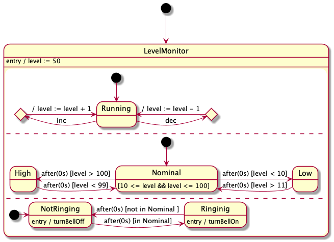

### Checking state invariants

This is easy. We just associate an invariant with each state. Then after each event is processed, we walk the tree to check all the invariants of active states.  However it might make more sense to only check the invariants only when there are no more events in the event queues and a series of `TICK` events have been processed with the latest `TICK` yielding no transitions.

## Other features that are not as useful and more difficult, but not impossible, to support.

### Local and internal transitions.

TODO

### Fork and Join.

TODO

### Composite transitions.

TODO

### Final states

TODO

### "do"

TODO

## Implementation details

### Saving a little space

Recall that the type for states is 

~~~c
struct StateS {
    StateKindT kind ;
    char *pcName ;
    EventHandlerT *pEventHandler ;
    ActionT *pEntryAction ;
    ActionT *pExitAction ;
    int childCount ;
    StateT **ppChildren ;    
    StateT *pParent ; 
    int depth ;    
    int index ;
    int activeChild ; } ;
~~~

The `childCount` and `ppChildren` fields only need to exist for AND and OR states.  And the `activeChild` field is only needed for OR.  This is clearly wasting a few bytes per state.  In C++ we would just use inheritance. Here is how to save space in C.  Let's make `StateT` a base class for `CompositeStateT`, which is a base class for `OrStateT`.

~~~c
typedef StateS StateT ;
...
struct StateS {
    StateKindT kind ;
    char *pcName ;
    EventHandlerT *pEventHandler ;
    ActionT *pEntryAction ;
    ActionT *pExitAction ;
    StateT *pParent ; 
    int depth ;    
    int index ; } ;
    
typedef struct CompositeStateS CompositeStateT ;
struct CompositeStateS {
    StateT base ;
    int childCount ;
    StateT **ppChildren ; }  ;

typedef struct OrStateS OrStateT ;
struct OrStateS {
    CompositeStateT base ;
    int activeChild ; }  ;
~~~

We need invariants that

* when `pState->kind == AND || pState->kind == OR`, that `pState ` should point to the first member of a `CompositeStateT` and that
* when `pState->kind == OR`, that `pState ` should point to the first member of the first member of an `OrStateT`.

Suppose `pState` is a pointer to a `StateT`. The following code illustrates casting between the various pointer types.

~~~c
if( pState->kind == AND || pState->kind == OR ) {

    // "Downcast" to a composite state pointer.
    CompositeStateT *pCompState = (CompositeStateT*) pState; 
    
    // "Upcast" to the base class.
    StateT pState1 = & pCompState->base ;

    assertThat( pState1 == pState )
    
    if( s->kind == OR ) {
        
        // "Downcast" to an OrStateT*.
        OrStateT *pOrState = (OrStateT*) pState ;
        
        // "Upcast to the base class"
        CompositeStateT *pCompState1 = & pOrState->base ;

        assertThat( pCompState1 == pCompState1 ) ;

        StateT *pState2 = & pOrState->base.base ;

        assertThat( pState2 == pState ) ;
    }
}
~~~

This is perfectly cromulent ISO C if the invariants are respected. The reason is works is that the C standard guarantees that the first member of a struct has the same address as the whole structure and that a pointer to one can be converted to a pointer to the other. A reasonable compiler should generate code that is no less efficient.

A similar trick could be played with events. However, since it may be necessary to copy event objects --e.g., into or out of queues-- it is probably better for all event objects to have the same size.

## Generating code

Given a state machine presented in a language such as PlantUML or similar, it should be straight forward to generate the representation of the statechart in C. One advantage of doing it this way is that we can generate pictures of the statechart for review.

## Recursion

I've used recursion extensively. Using recursion is generally a no-no in embedded design. For example, it is against the MISRA coding rules.

The problem with recursion is that the depth of recursion and hence the amount of stack space used by a call may depend on the input. For example, a naively implemented quicksort can make 1000 nested calls to sort an array of size 1000.

In all the cases where I've used recursion here, the depth of the recursion is limited to roughly one or two times the number of levels in the original statechart; this is usually going to be a fairly small number. If recursion is still a problem, it can be removed in favour of an explicit stacks of states, which can be statically allocated, using standard recursion removal techniques.

# References

[1] David Harel, Statecharts: a visual formalism for complex systems. Science of Computer Programming, 8, 3, June 1987, https://doi.org/10.1016/0167-6423(87)90035-9

[2] von der Beeck, M. A structured operational semantics for UML-statecharts . SoSyM 1, 130–141 (2002). https://doi-org/10.1007/s10270-002-0012-8

[3] Object Management Group, OMG UML Modelling Language, Version 2.5.1, Dec 2017.

