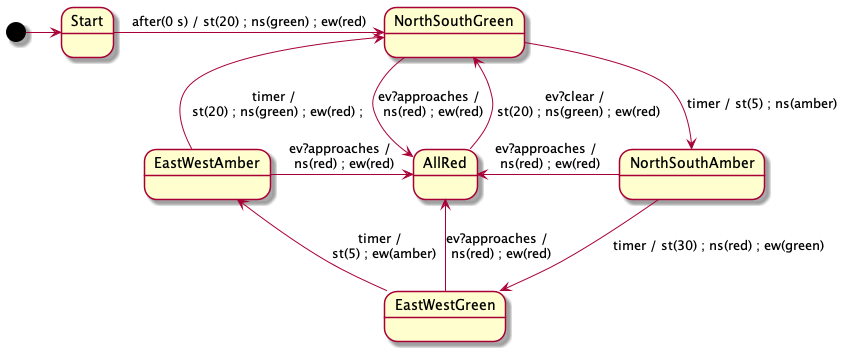
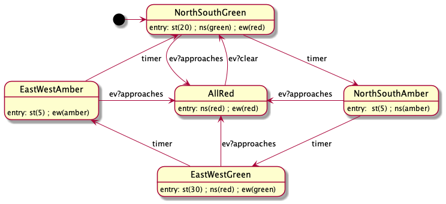
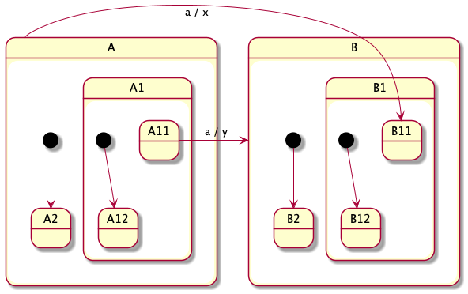
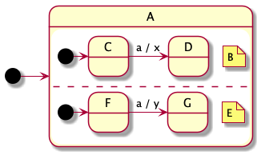
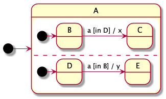
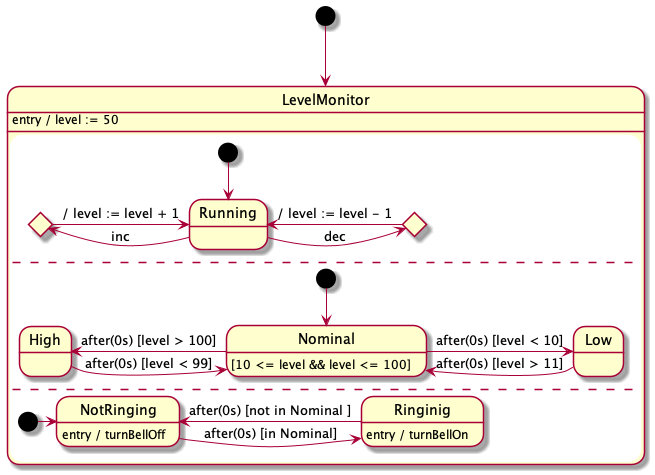

# Statecharts

## Introduction

Statecharts are a formalism for describing finite state machines.  Statecharts allow complex state machines to be expressed concisely and, if used carefully, understandably.  State machines are widely used in digital hardware design, embedded software design, user experience design, protocol design, and many other things.

Statecharts were introduced by David Harel in the 1980s [1].  Because they are visual and fairly simple to understand, he found that they were a good medium for expressing behavioural ideas to people who are not familiar with other ways of expressing algorithms, such as code, pseudocode, or flowcharts.  (More on flowcharts later.)  In Harel's case he developed them while consulting for the Israeli air force and he found them to be a good medium for presenting algorithmic ideas to pilots.

In the 1990s, statecharts were adopted as one of the diagram types in UML. As a result there is a standard syntax and a fairly well defined semantics, suitable for software.  My understanding of the finer points of the semantics comes largely from von der Beeck's article on the semantics of UML statecharts, which is  based on the UML specification.

## Simple state machines

Reactive systems spend most of their time waiting for something to happen.  When an embedded system is based around a microcontroller, the microcontroller will often switch to a low power mode while it waits for the next thing to happen to it or for a certain amount of time to pass.  Then it reacts by taking some action and usually goes back to a low power mode.  Which events a reactive system will react to and how it will react to them depends on what events it has experienced in the past.  A state represents a summary of this history.  When the system is waiting, it will be in some state.  Which state it's in will (largely) determine which events it will react to and how it reacts to them.

Here is a first statechart.

There are 6 **states** shown in this diagram: `Start`, `NorthSouthGreen`, `NorthSouthAmber`, `EastWestGreen`, `EastWestAmber`, and `AllRed`.  The black ball is not a state but serves to indicate which state is the **initial state**. The black ball is sometimes called a **pseudo state**.

The arrows between states are called **transitions**. Each transition is labelled trigger, and a sequence of **actions**.  The syntax for transition labels, so far, is one of

> *trigger* / *sequenceOfActions* 
> *trigger*

A trigger is typically the name of a class of signals.  This means that the transition can be triggered by the arrival of a signal with that name.

 There are also time triggers, such as the "after(0 s)" trigger on the transition out of the "Start" state.  As you would expect this means that the "Start" state can be left as soon as it's been entered.  We'll look at time events with longer delays and absolute times later on.

So far, the syntax of triggers is one of

> *signalName*  
> `after( 0s )`

For this statechart there are 3 classes of signals named `timer`, `ev?approaches`, and `ev?clear` .   I use the convention that a message *m* received on a channel *x* gets the name *x?m*. That's not part of the UML standard, but it makes it clearer where which events are messages and where they are coming from. 

It's a good idea to make a table to explain what kind of event each signal class corresponds to. 

| Signal class | Meaning |
|---------------------|-----------------|
| `timer`          | The internal timer expires. |
| `ev?approaches` | A message arrives from central dispatch indicating that an emergency vehicle is approaching. |
| `ev?clear` | A message arrives from central dispatch indicating that no emergency vehicle is approaching. |

We also have a number of actions shown in the statechart.  We should make a table explaining them as well 

| Action | Meaning |
|---------------------|-----------------|
| `st( n : Real )`        | Set the internal timer to expire in `n` seconds.  Any pending setting is overridden. For example if an `st(5)` actions is shortly followed by an `st(30)` action, the effect of the first is nullified. |
| `ns( c : Colour)` | Set the lights for north and south going traffic to colour `c`. |
| `ew( c : Colour)` | Set the lights for east and west going traffic to colour `c`. |

## Semantics for simple state machines

Statecharts handle one event at a time.  Events are usually processed in the order they arrive, but they don't have to be. The basic algorithm for a state chart is this

> Basic Statechart algorithm:
>
>> `current_state` := the initial state 
>> loop 
>>> Wait until one or more events are ready to be processed
>>> Pick an event `e` to process 
>>  Process event `e`
>> 
>> end loop

> Process event `e` : 
>> if there are one or more transitions out of the `current_state` labeled with the signal class of `e`
>>
>>> if there is more than one, optionally log an ambiguous event end if 
>>>`t` := one of these transitions  
>>>Execute the action sequence of transition `t` 
>>>`current_state` := the destination state of `t`
>>
>> else if it is not a `TICK` event
>> 
>>> Optionally log the lost event.
>>
>> end if

`TICK` events are used to represent the passage of time and can trigger transitions that have triggers that have to do with TIME. We need to make sure that `TICK` events are processed frequently.

Note that there might be no transitions out of the current state that are labelled by the current signal's class.  In that case the event is lost.  This might be ok, but it often indicates a design flaw, which is why you might want to log these events.  In the traffic light example, you can see that when the current state is `AllRed`, `timer` signals will be lost, as will `ev?approaches` signals and in the other four states, `ev?clear` signals will be lost; these are intentional and don't represent design flaws.

Also there might be an ambiguity about what transition to follow.  In this case the choice is arbitrary.  Consider this example.  After 3 `x` signals the sequence of reactions could have been any of `b;a;b`, `b;a;c`, `c;a;b`, or `c;a;c`. 

It's almost always a design flaw to do this, but these situations are usually easy to detect during design.

## Entry and Exit actions

We can associate "entry" and "exit" actions with each state.  This often allows us to simplify the transitions into and out of the states and to make statecharts easier to read.  In the case of our traffic light example, we can eliminate the `Start` state, since its only purpose was to ensure that the lights are set appropriately on entering the `NorthSouthGreen` state.  We get this machine:

## Nested OR states

One way that Statecharts go beyond ordinary state machines is by allowing states to be nested.  So the set of states will make a tree.  The parent of such a nested state is called an OR node. (Later we'll see that parents can also be AND nodes.) We've already seen that there is a conceptual OR node at the root.

Here is an example with an OR node that is not the root.

There are significantly fewer transitions.   Generally, nesting states helps to keep complex machines reasonably concise and readable.

Nesting creates some issues.  The first that the machine can now be "in" multiple states at the same time.  I.e., more than one state can be active.   The rule for OR states is

* If an OR state is active, exactly one of its children is active.
* If an OR state is not active, none of its children are active.

In our example, when `Normal` is active, exactly one of its four children will be active. And when `AllRed` is active, no other state is active except the root state. The root is an OR state that is always active (after initialization), so either `AllRed` or `Normal` will be active, but never both at the same time.

When `Normal` is active an `ev?Approaches` event will change the active state of the root to `AllRed`, meaning that not only does `Nomal` become inactive, but also its active substate.

The transition from `AllRed` to `Normal` is interesting because it doesn't indicate which child of `Normal` should be active.  So it will be the start state for `Normal`, which is `NorthSouthGreen`.

If the designers decided that it is better to go from `AllRed` to a different state that can be done like this: 

This is an example of an interlevel transition. It's usually good advice to avoid them, but sometimes they are very useful.

What does this mean for entry and exit actions?

Consider this example

Suppose the active states are {C, A, A1, A11, A112} and the transition from A11 to B11 is triggered.  The states {A, A1, A11, A112}, but not C, are all exited, so their exit actions must take place.  Then the states {B, B1, B11, B112} need to be entered, so their entry actions are executed.  B112 is entered of course because it's the start state for B11.  Exits should happen bottom-up. Entries should happen top-down.  

> Exit actions: A112, A11, A1, A  
> Transition actions  
> Entry actions: B, B1, B11, B112

Another issue that comes up with nesting is the priority of conflicting transitions.  We already saw that when there are conflicting transitions out of an active state, the choice is undefined.  But now there can be more than one active state, the priority goes to transition with the deepest source state that can fire.  For example here the priority goes to the transition out of A11 if A11 is active.

## AND states

At last we come to AND states.  AND states provide concurrency.  Like an OR state, an AND state has a set of children.  But the rule for AND states is that:

* If an AND state is active, all of its children are also active.
* If an AND state is not active, none of its children are active.

AND states are drawn as states divided up into 2 or more "regions" by dotted lines.  Each region is an OR state and so should have at least one child.  Here is an example of a statechart in  UML notation with both AND states and OR states.

In PlantUML (which I'm using to make the pictures), there doesn't seem to be a way to give names to regions, so I've included the names as notes for clarity.  At any time the set of active states could be any of the following

* {root, A, B, C, E, F}
* {root, A, B, C, E, G}
* {root, A, B, D, E, F}
* {root, A, B, D, E, G}
* {root, H, F, J, L, M}
* {root, H, F, J, L, N}
* {root, H, F, K, L, M}
* {root, H, F, K, L, N}

Here is a tree diagram showing the states of the previous statechart as tree.

The combination of AND and OR states allows us to model complex concurrent systems in a modular way. If we were to rewrite a statechart with N states, as a simple state machine, this could require up to O(2^N) states.   Consider a city with 100 traffic lights.  At any point in time each light could be in one of 5 configurations.  Thus the total number of configurations is 5^100 which is over 7 x 10^69.  Yet our statechart would need only 500 basic states.

**Aside** on terminology and the meta-model.  What I call a "BASIC state", the UML standard calls a "simple state"; what I call an "AND state", the UML standard calls a "composite state"; and what I call an "OR state" the UML standard calls a "region".  UML also has a kind of state called a "submachine state", which I'm ignoring.  In the standard "regions" aren't really states; and there is a strict alternation so that composite states contains only regions and regions contain only "simple", "composite", and "submachine" states.  That sometimes means that UML diagram need "composite states" that have only one child, whereas in our model, an AND state with only one child is never needed.  (Composite states with more than one child are called "orthogonal states" in the standard.) Furthermore, in UML there might be a region with only one child, whereas, in our model there is (almost) never a need to have an OR state with only one child.  My terminology and model is based on von der Beeck's paper [2], which is based on Harel's model and terminology [1]. **End aside.**

With concurrent states we can have a situation like this:

If the active states are {root, A, B, C, E, F} and an `a` event is processed what should happen? 

The obvious choices are that one of the transitions fire or that they both fire.  Statecharts use a "broadcast" model, meaning that events are processed by all the children of an AND state, but the order of processing is not defined.  So, in this example, either of the following sequence of actions should happen:

*  Exit C, x Enter D, Exit F, y, Enter G, or
*  Exit F, y, Enter G, Exit C, x Enter D.

In either case the set of active states after the event is processed will be {root, A, B, D, E, G}.

Transitions into and out of AND states are interesting, but basically logical.  Consider these transitions

Suppose the active states are {root, A, B, D, E, G}.  Any of the four transitions can happen

* `a`. In this case A must be exited, so B and E must exited, so D and G must be exited.  All this happens in postfix order. But exits from the AND's children could happen in either order.  So the order of exits is either
    * D, B, G, E, A or G, E, D, B, A.
    * After all these exits, the transition action happens.
    * Next, H is entered and so I and L must be entered and so J and M are entered.  Now it's prefix order, but the order that the children of the AND are entered is nondeterministic. So the possible orders are
    * H, I, J, L, M or H, L, M, I, J
* Events `c` and `d` are similar.
* Event `d` is similar, except that J is entered instead of K.

By the way PlantUML can't handle transition in and out of regions. That's why the last figure looks a bit doctored.  It's legit UML, but Plant UML just doesn't cope with them.  You can use composite transitions instead in the diagram.  I'm not dealing with composite transitions in this document.  For more information see the PlantUML documentation.

## Other features that are useful and easy to support

### Guards 

Guards are boolean expressions written in a transition's label.

The syntax for transition labels, so far, is one of

> *trigger* / *sequenceOfActions* 
> *trigger*  
> *trigger* [ *guard* ] / *sequenceOfActions* 
> *trigger* [ *guard* ]

So far, the syntax of triggers is one of

> *signalName*  
> `after( 0s )`

A guarded transition will only fire if the guard is true.  When more than one transition out of a state is labelled with the current signal, and more than one of those has a true guard, there is a conflict and the choice between the transitions is arbitrary.  Consider this example.

If the active states are `A` and `B`, and an `a` signal is processed

* If `P` is true and `Q` is false, then the transition to `C` will happen.
* If `Q` is true and `P` is false, then the transition to `D` will happen.
* If both are true, one (but not the other) of these two transitions will happen.
* If both are false, the transition to `E` will happen.

### Branching with choice pseudo-states

Branching uses "choice" pseudo-states, which are drawn as diamond shaped nodes. There is usually one transition coming in and multiple transitions coming out of the diamond. The transitions coming out can not be labelled with a trigger and normally have guards.

Pseudo-states are not states, in that the machine never rests in a pseudo-state. 

Let's consider this example and compare it with the guards example above.

Again suppose the active states are `A` and `B`and and `a` signal happens.

* If `R` is false, the transition out of `B` can't be taken, so the transition from `A` to `E` is taken: `B` is exited, `A` is exited, action `z` happens and `E` is entered.
* If `R` is true, the transition out of `B` must be taken. `B` is exited and action `w` happens. However, as we have not reached a state yet, the event processing is not finished.  So now `P` and `Q` are evaluated. Note that `R` is evaluated before action `w`, whereas `P` and `Q` are evaluated after.

    * If `R` is true, `P` is true, and `Q` is false, the transition to `C` is taken, so action `x` happens and `C` is entered.
    * If `R` is true, `Q` is true, and `P` is false, the transition to `D` is taken, so action `y` happens and `D` is entered.
    * If `P`, `Q`, and `R` are all true, there is an arbitrary choice between the two transitions out of the pseudo-state.
    * The remaining possibility is that `R` is true and both `P` and `Q` are false. The UML standard says that if this can happen, the model is "consider ill formed"; in other words there is an error.

To make it easy to avoid the sort of design error just mentioned, there is a special guard `else` that means the negation of all the other guard out of the same choice pseudo state.

The transitions from `B` to `C` and `D` in the above example are examples of "compound transitions". 

### in and not in

Two guards that are sometimes used are `[in S]` and `[not in S]` where S is the name of state. The first is true iff S is active. 

Here is an example where the choice between transitions in one state is determined by  the situation in a concurrent state.

### A warning about "in" and "not in"

Conceivably you could have two transitions fire concurrently.  In this case our implementation might leave a state before another transitions guard is evaluated. I'm not sure this is good UML, but the behaviour of our implementation will depend on the order the transitions fire, which is probably not good.

Consider this example, if the active states are `A`, `B`, and `D` and an `a` signal happens, then, with the proposed implementation, only one of the transitions will happen and which one will happen depends on the order that the children of `A` happen to be in. 

A similar issue comes up with other guards that might be affected by actions of other, concurrent, transitions.

Anyway, it would be weird for this sort of case to come up, but it could.

### Internal communication

#### Shared variables

The children on an AND node can be thought of as concurrently executing "pseudo threads". I'm calling them pseudo threads because there is no multithreading in the traditional sense and, in particular there is no pre-emption. Each transition executes as an atomic action with respect to any other transitions in the machine.

This means that pseudo threads can safely communicate by means of shared variables like this.

Here there are three pseudo-threads. The top pseudo-thread maintains increments and decrements shared variable `level`. (The use of choice pseudo-states here is gratuitous -- I only used the pseudo-states because PlantUML does a lousy job when more than one transition forms a loop on a state.) The middle pseudo-thread reads `level` and classifies the value of level into three buckets. The bottom pseudo-thread abstracts the three buckets into two and controls an alarm.

So a shared variable `level` is used to communicate here between the top and middle pseudo-threads.

#### Internal signals

Another way for pseudo-threads to communicate is by firing signals. For example

Here if the active states are {`A`, `B`, `D`} and a `go` signal happens, first there will be a transition to {`A`, `C`, `D`}. The action here is `int`, which is also an signal. Executing `int` as an action queues an `int` signal. This will cause a subsequent transition from `D` to `C`.

Note that this is an asynchronous communication between the pseudo states.  In David Harel's original statechart semantics, internal communications like this were synchronous, meaning that there would be an immediate transition from {`A`, `B`, `D`} to {`A`, `C`, `E`}.  This makes a lot of sense if you are modelling clocked digital hardware, where the entire transition can be made from one clock cycle to the next.  Later, when Harel developed the statechart tools for software, he introduced the asynchronous interpretation.

In UML statecharts, the order that events are processed is not defined. Suppose that a `go` and `stop` message arrive in quick succession. Both will be queued. If the `go` message is processed first, it will create an `int` signal, which is also queued. Whether the `int` or `stop` signal is processed next is not defined by the UML standard. So the sequence of transitions could be either

* $\{{\tt A},{\tt B},{\tt D}\}\stackrel{{\tt go / int}}{\longrightarrow}\{{\tt A},{\tt C},{\tt D}\}\stackrel{{\tt int / x}}{\longrightarrow}\{{\tt A},{\tt C},{\tt E}\}\stackrel{{\tt stop / y}}{\longrightarrow}\{{\tt A},{\tt B},{\tt E}\}$ or
* $\{{\tt A},{\tt B},{\tt D}\}\stackrel{{\tt go / int}}{\longrightarrow}\{{\tt A},{\tt C},{\tt D}\}\stackrel{{\tt stop / y}}{\longrightarrow}\{{\tt A},{\tt B},{\tt D}\}\stackrel{{\tt int / x}}{\longrightarrow}\{{\tt A},{\tt B},{\tt E}\}$

### More on triggers

A trigger is what determines whether a transition can proceed, so far we've only seen one kind of trigger which is an *signalName*; there are other possibilities.  The syntax of transition labels is one of

> *trigger* / *sequenceOfActions* 
> *trigger*  
> *trigger* [ *guard* ] / *sequenceOfActions* 
> *trigger* [ *guard* ]

Wnere a *trigger* is one of

> *signal event*  
> *time event*
> *change event* 
> *call event*  
> *any receive event*  

Of these

* *signal event*. The simplest form of a *signal event* is just a *signalName*, which we've seen a lot of.  I'll look at the other cases below.
rDelayCode* *time event* is dealt with next.
* *change event*. I'm going to ignore these, since I'm not sure I understand them.
* *call event*. I'm going to ignore these, since they are mostly useful for describing classes in OO programming.
* *any recieve event*. I'm going to ignore these.

### Time events.

There are two kinds of time event. The first looks like this

> `after(` *duration* `)`

where the duration is something like `0s` or `45ms`.  The corresponding time event happens when that much time has elapsed since the source state was entered.

The second kind looks like this

> `at(` *time* `)`

Where *time* indicates some specific time. A sensible way to do this is to use some specific time (like 00:00GMT on Jan 1, 1970) as an origin and specify the time as the number of miliseconds since then.  Or you could use the time of the last boot as time 0.

### Signals with parameters

Signals are often parameterized, especially when the signal corresponds to a message being received from some other system. The syntax for signal triggers is one of

> *signalName*    
> *signalName* `(` *paramName* `)`   
> *signalName* `(` *paramName*, *paramName* `)`   
> *signalName* `(` *paramName*, *paramName*, *paramName* `)`   
> etc.

### History

An OR state can contain a "shallow history" and/or "deep history" pseudo state. Transitions from outside the OR state can end at such a pseudo-state.

* If the transition ends at a shallow history pseudo-state then the target of the transition is the latest child of the OR state to be active.
* If the transition ends at a deep history pseudo-state, then the target of the transition is the latest descendant of the OR state to be active.

### State invariants

Often when you know that a state is active, you can conclude that other things are also true.  It can be useful to document these facts as invariants associated with states and to check that all the invariants are true.

This seems a simple idea, but I'm not 100% sure I understand it.  For example if you look at the `Nominal` state, in the shared variables. It seems reasonable that it would have an invariant of

> $10 \le {\tt level} \le 100$

However, if that were really an invariant, a transition labelled 

> ${\tt after(0s) \; [level < 10]}$

would be completely useless since the invariant says the guard can not be true.  If we interpret invariants as only needing to hold when the state machine is completely stable, then the stated invariant is ok.

## Other features

### Local and internal transitions.

TODO

### Fork and Join.

TODO

### Composite transitions.

TODO

### Final states

TODO

### "do"

TODO

# References

[1] David Harel, Statecharts: a visual formalism for complex systems. Science of Computer Programming, 8, 3, June 1987, https://doi.org/10.1016/0167-6423(87)90035-9

[2] von der Beeck, M. A structured operational semantics for UML-statecharts . SoSyM 1, 130–141 (2002). https://doi-org/10.1007/s10270-002-0012-8

[3] Object Management Group, OMG UML Modelling Language, Version 2.5.1, Dec 2017.
